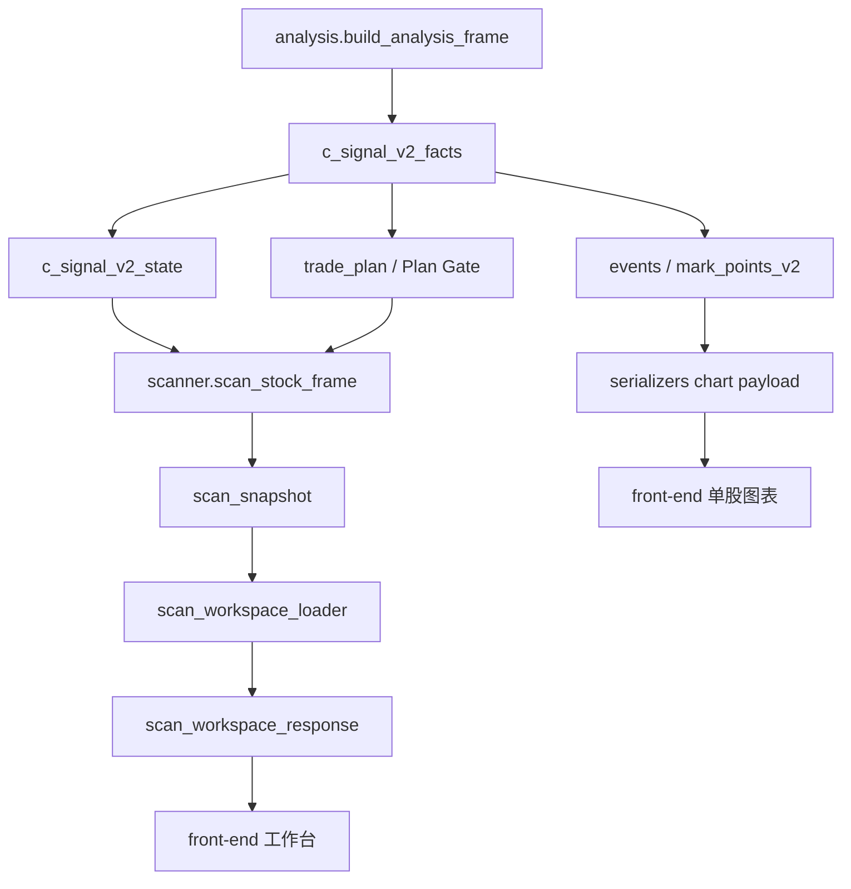

# C 信号 V2 代码耦合审计

> 日期：2026-09-13  
> 口径：基于 P23-A/P23-B/P23-C 后的当前代码。  
> 结论：当前没有明显的 Python 直接双向 import 环，但存在较强的语义耦合、性能耦合和前端全局状态耦合。后续不宜继续叠加指标，应先收紧边界。

## 1. 当前主链



当前 P20 已改善单股首屏：`/api/analyze` 会复用同一份 V2 facts/events，并把 60m/4h 图表移到 `/api/analyze/timeframes` 懒加载。但全局架构仍有几处耦合需要拆。

## 2. 耦合风险

### A. V2 合约层和 legacy 事件混放

位置：

```text
stock_analyzer/c_signal_v2_contracts.py
stock_analyzer/legacy_c_signal_adapter.py
stock_analyzer/c_signal_v2.py
```

状态：P23-B 第一阶段已修复。

现状：

- `c_signal_v2_contracts.py` 只保存 V2 原生事件合约；
- `legacy_c_signal_adapter.py` 只负责 legacy `composite_*`、`old/new/opt` 到 V2 语义的备用翻译；
- `c_signal_v2.py` 只保留状态机、许可和优先级计算，并通过兼容 facade 暴露 `c_signal_v2_fields()`；
- `events.py / scanner.py / scan_snapshot.py / multi_timeframe.py` 已直接读取 adapter 的兼容出口。

已降低的风险：

- 旧 C 备用映射不再和 V2 主状态机混在同一文件；
- 后续做 P21 旧经验吸收时，代码边界会提醒先翻译为 V2 facts/gate；
- 单股页、扫描页、事件页仍兼容旧缓存，但不会把旧 C 映射误当主链合约。

剩余风险：

- `build_c_signal_v2_state_from_result()` 仍识别 legacy key 以兼容旧缓存；
- 若后续新增 legacy key，必须只进入 adapter，不应写回 V2 主链文件。

### B. 事件层依赖 V2 合约层，展示语义反向进入领域事件

位置：

```text
stock_analyzer/events.py
stock_analyzer/c_signal_v2.py
```

现状：

- `events.py` 定义 `SignalEvent` 与事件构建；
- 但 `event_to_mark_point()` 又调用 `c_signal_v2_mark_fields()`；
- 这会让事件层直接依赖 V2 展示字段。

风险：

- 后续如果改 marker role、信号名、备用旧 C 映射，事件生成层也被牵动；
- `events.py` 同时承担领域事件和前端 mark point 序列化职责。

建议：

- `events.py` 只产出领域事件；
- 新增 `event_markers.py` 或放入 `serializers.py`，专门把事件转成前端 marker；
- marker 语义从 V2 contract 读取，但不要让事件构建层读取前端字段。

### C. 单股图表序列化 legacy 默认值已关闭

位置：

```text
stock_analyzer/serializers.py
```

状态：P23-C 第一阶段已修复。

现状：

- `analysis_frame_to_chart_payload()` 默认 `include_legacy=False`；
- 默认 payload 只构建并返回 V2 图面事件；
- `mark_points` 默认等同 `mark_points_v2`；
- old/new/opt 图面字段只在 `include_legacy=True` 时返回；
- `/api/analyze?legacy=1` 或 `include_legacy=1` 是当前备用对照入口。

已降低的风险：

- 默认单股响应不再暴露 old/new/opt，降低“旧策略仍是主线”的误解；
- 旧 C 备用参考保留在显式 debug 分支，不影响 V2 主链；
- 分时 chart cache key 已纳入 `include_legacy`，避免旧 payload 缓存误命中。

剩余建议：

- P24 继续治理前端 analysisStore 与历史文案；
- 如后续要展示旧 C 对照，应放入独立备用分析面板，而不是默认图表主链。

### D. 扫描快照构建没有统一复用 V2 上下文

状态：P23-A 第一阶段已修复。

位置：

```text
stock_analyzer/v2_analysis_context.py
stock_analyzer/scan_snapshot.py
stock_analyzer/scanner.py
stock_analyzer/trade_plan.py
```

现状：

- 已新增 `build_v2_analysis_context()`，统一产出 `components / facts / structures / events / state / trade_plan / score_summary`；
- `build_scan_snapshot()` 当前每只股票只构建一次 V2 analysis context，再传给三个扫描池；
- `scan_stock_frame()` 支持接收 `analysis_context`，不传时仍兼容旧调用并自行构建；
- 单股 `/api/analyze` 已通过同一 context 复用 facts/events/state/trade_plan；
- 分时 `/api/analyze/timeframes` 已通过同一 context 取日线 score summary。

已降低的风险：

- 全市场重刷中同一只股票三个扫描池重复构建 V2 facts/state 的问题已收敛；
- snapshot 级 trade plan 与扫描池 state 已开始共享同一份 facts/structures；
- 后续参数消融有了统一入口，便于继续加计时和断言。

剩余风险：

- 部分 priority/explanation/debug 路径为了兼容旧调用，仍允许缺少 context 时自行补算 facts；
- 如果后续新增入口不走 `build_v2_analysis_context()`，仍可能重新引入语义漂移。

建议：

- P23-A-2 继续把新增入口约束为优先传 context；
- P23-B 拆出 V2 contract 与 legacy adapter；
- P23-C 已清理单股 chart payload 里的旧图面默认字段。

### E. 工作台首屏响应过重

位置：

```text
stock_analyzer/scan_workspace.py
stock_analyzer/scan_workspace_response.py
stock_analyzer/web/scan_api.py
static/js/scanWorkspaceStore.js
```

实测：

```text
/api/scan_workspace?limit=120&lite=1
真实 5009 HTTP：9.503 秒
响应体：约 27.9 MB
```

现状：

- lite 模式仍返回大量结构、池详情、候选字段和解释字段；
- 首屏需要的其实是 meta、池计数、当前页候选和必要筛选项。

风险：

- 前端首屏慢，即使单股分析已优化；
- 大 JSON 会拖慢浏览器解析与渲染；
- 后续字段越加越慢。

建议：

- 拆成 `workspace/meta`、`workspace/candidates`、`workspace/overview` 三类接口；
- 首屏只取 meta + active pool 第一页；
- 详情字段改为点击候选后按需加载。

### F. 历史和数据源接口每次遍历大量文件

位置：

```text
stock_analyzer/scan_history.py
stock_analyzer/data_sources.py
stock_analyzer/scan_cache.py
```

实测：

```text
/api/scan_history?limit=30：约 15.903 秒
/api/data_sources：约 36.573 秒
```

现状：

- 历史接口逐个读取快照 JSON；
- 数据源接口会扫描本地缓存目录，并读取日线文件尾部判断真实日期。

风险：

- 平台打开时多个慢接口并发，用户体感会明显卡；
- 文件越多越慢，属于线性退化；
- 和策略优化无关，却会被用户误认为“策略慢”。

建议：

- 新增本地索引文件，例如 `.cache/scan_snapshots/index.json` 和 `.cache/data_sources/status.json`；
- 扫描/重刷完成时更新索引；
- 页面打开时优先读索引，手动刷新时才全量重建。

### G. 前端分析页全局状态已收敛到 analysisStore

位置：

```text
static/js/analysisStore.js
static/js/app.js
static/js/chartView.js
static/js/signalPanel.js
static/js/scanStrategyCompare.js
```

状态：P24-C 已修复主要耦合。

现状：

- `analysisStore` 统一持有 `rootData / viewData / activePeriod / analysis request id / timeframe request id`；
- `lastData / lastAnalysisData / activeChartPeriod / timeframeLoadPromises / timeframeLoadErrors` 旧裸全局分析态已移除；
- 周期切换、候选定位、图表渲染、多周期卡片、策略视角刷新优先读取 `analysisStore`；
- 关键脚本加载顺序已固定为 `api.js -> analysisStore.js -> app.js`。

已降低的风险：

- 用户快速切换股票或周期时，旧请求返回后会被 request id 拦截；
- 60m 与 4H 不再共享同一个加载状态；
- 前端当前分析态不再由多个裸全局变量共同维护。

剩余风险：

- 尚未形成稳定的浏览器点击链路 E2E；
- 若后续新增单股页模块，必须从 `analysisStore` 读取当前分析态，不能重新引入裸全局状态。

## 3. 后续需求排序

### P22-A 工作台首屏瘦身

状态：已完成主要实现。

目标：让平台打开先可用。

要求：

- `/api/scan_workspace?lite=1&active_type=...` 只返回 meta、池计数、active pool 当前页和必要筛选项；
- 非当前池只返回 count/loaded_count/has_more，用户切换池子时再加载对应页；
- compact 候选移除完整 `trade_plan`、完整技术结构、完整 facts 结构明细和完整画像关系明细；
- 候选详情通过 `/api/scan_workspace/candidates?detail=1&code=...` 按需直读单只快照并补画像/关系证据。

实测：

- 原 `/api/scan_workspace?limit=120&lite=1` 约 27.9 MB；
- 新 compact 首屏本地紧凑估算 1.57 MB，真实 5009 HTTP 约 1.883 MB；
- `refresh=1` 强刷仍约 8-10 秒，说明剩余瓶颈在 workspace 构建，不在网络传输；
- 候选详情从全池筛选的约 22.7 秒降到快照直读约 0.173 秒。

优先级：最高。

### P22-B 历史索引缓存

状态：已完成。

目标：避免打开平台时反复解析全部快照。

要求：

- 已建立快照日索引缓存；
- `list_scan_history()` 默认按目录指纹命中索引；
- `refresh=1` 时重建索引；
- 当前未做写入时主动更新，而是通过文件数/mtime/size 指纹自动失效。

实测：冷建索引 16.297 秒，缓存命中 0.399 秒。

优先级：高。

### P22-C 数据源状态缓存

状态：已完成。

目标：让 `/api/data_sources` 不再每次扫全量历史文件。

要求：

- `/api/data_sources` 默认返回最近一次缓存；
- `refresh=1` 才做全量扫描；
- 核心 `collect_data_source_status()` 默认仍实时计算，避免测试和内部调用被缓存污染。

实测：冷刷新 37.228 秒，缓存命中 0.001 秒。

优先级：高。

### P22-D 分时懒加载按周期拆分

状态：已完成；P22-D-2 已补 chart payload 缓存与事件窗口化。

目标：避免点击 60m 时同步构建 4H，点击 4H 时同步构建 60m。

要求：

- `/api/analyze/timeframes?code=...&period=60m` 只构建并返回 60m chart；
- `/api/analyze/timeframes?code=...&period=4h` 只构建并返回 4H chart；
- 不带 `period` 时保留旧兼容行为，仍返回 60m + 4H；
- 前端周期按钮带目标周期请求，且按周期维护加载状态；
- 单股首屏 `/api/analyze` 继续不返回分时 chart。
- 分时 chart payload 写入 `.cache/timeframe_charts/`，命中后不再重建 V2 图面事件；
- 分时 chart summary 复用 chart 中的 V2 events/facts，不再在同一请求中重复构建；
- 分时图面事件窗口调整为最近 40 根，减少首次点击成本。

实测：

- `/api/analyze?code=600063`：3.299 秒；
- `/api/analyze/timeframes?code=600063&period=60m&refresh=1`：2.362 秒；
- `/api/analyze/timeframes?code=600063&period=60m`：0.164 秒；
- `/api/analyze/timeframes?code=600063&period=4h&refresh=1`：2.102 秒；
- `/api/analyze/timeframes?code=600063&period=4h`：0.113 秒；
- `/api/analyze/timeframes?code=600063`：0.190 秒，前提是 60m/4H 都已命中 chart 缓存。

剩余风险：首次点击仍需要约 2 秒，因为要构建当前周期的 V2 chart；如果后续还要压低首次点击时间，应做后台预热或 facts 增量计算，而不是继续压缩展示语义。

优先级：高，第一阶段已完成。

### P22-E 工作台 compact 持久缓存

状态：已完成第三阶段。

目标：让普通打开平台和切换池子不再依赖进程内短缓存。

要求：

- compact workspace 响应写入磁盘缓存；
- 缓存 key 区分 `active_type`，同时包含 limit、snapshot_day、start_date、数据目录和画像目录；
- 依赖指纹包含快照目录、策略版本、快照 schema、解释版本、画像/概念/关系证据和板块行情缓存；
- `refresh=1` 强制重建，并预热各池 compact 缓存；
- 持久缓存只保存 web 响应，不替代策略事实源。

实测：

- 强刷生成缓存：8.696 秒；
- 进程重启后 opportunity 命中：0.578 秒；
- 进程重启后 risk 命中：1.475 秒；
- 进程重启后 bottom_div 命中：0.507 秒。

剩余风险：强刷/快照变化后的第一次构建仍慢，下一步需要快照级增量索引，而不是继续压缩响应体。

### P23-A V2 上下文对象

状态：已完成第一阶段。

目标：统一 facts/state/events/plan 的计算入口。

要求：

- 已新增 `build_v2_analysis_context(df, context=None)`；
- 单股、扫描快照和分时懒加载路径已优先复用 context；
- 下游模块在已有 context 时不再重复 build facts/state；
- 已为 context 构建、空数据路径和扫描快照 context 复用补测试。

实测：

- `build_scan_snapshot(600063)` 当前 context 复用路径：0.065 秒；
- 旧式每个池单独 `scan_stock_frame()` + trade plan：0.290 秒。

优先级：高。

### P23-B V2 合约拆分

状态：已完成第一阶段。

目标：把 V2 主链和旧 C 备用翻译拆开。

要求：

- 已新增 `c_signal_v2_contracts.py`：V2 signal/state/marker 合约；
- 已新增 `legacy_c_signal_adapter.py`：旧 C key 到 V2 语义的备用翻译；
- `c_signal_v2.py` 已不再直接承载 legacy mapping；
- 前端文案不再显示“旧策略主线”，剩余“旧缓存/备用参考”体验治理归入 P24。

优先级：中高。

### P23-C 图表 payload 去 legacy 默认值

状态：已完成第一阶段。

目标：减少单股响应体与认知噪音。

要求：

- 已实现 `analysis_frame_to_chart_payload(include_legacy=False)`；
- `/api/analyze` 默认只返回 V2 mark points；
- `/api/analyze?legacy=1` 或 `include_legacy=1` 才返回 old/new/opt 备用字段；
- 60m/4H 延后加载图表 payload 固定为 V2-only；
- 历史测试已通过显式 `include_legacy=True` 覆盖旧字段备用路径。

实测：

- `/api/analyze?code=600063`：8.202 秒；默认无 old/new/opt，`event_stats` 仅含 `v2`；
- `/api/analyze?code=600063&legacy=1`：6.846 秒；显式返回 old/new/opt；
- `/api/analyze/timeframes?code=600063&period=60m`：首次 4.700 秒，缓存命中 0.232 秒；
- `/api/analyze/timeframes?code=600063&period=4h`：首次 5.635 秒，缓存命中 0.130 秒。

优先级：中。

### P24 前端 analysisStore

状态：已完成第一阶段。

目标：治理单股页异步状态耦合。

要求：

- 已新增 `static/js/analysisStore.js`，统一管理当前股票 root payload、当前图表 view payload、周期、分时加载请求和错误状态；
- `analyzeStock()` 已通过 request id 拦截旧单股响应；
- `loadDeferredTimeframeCharts()` 已通过 period request id 拦截旧 60m/4H 响应；
- 周期懒加载响应只补充 chart 数据；只有当用户最后选择仍是该周期时，响应才允许触发图表切换；
- `renderChart()`、`setChartPeriod()`、`focusSignal()` 已优先读取 analysisStore；
- `signalPanel.js` 的图例筛选重绘、辅助确认卡片、交易计划和 V2 state 读取已优先使用 analysisStore；
- `scanStrategyCompare.js` 的策略视角切换重绘已优先使用 analysisStore；
- 已移除旧裸全局分析态，不再由 `lastData / lastAnalysisData / activeChartPeriod / timeframeLoadPromises / timeframeLoadErrors` 串联当前页面；
- 已新增 `tests/test_frontend_analysis_store.py` 覆盖旧请求不污染当前状态、关键脚本加载不创建旧全局变量，以及 60m/4H 并行加载时后返回响应不抢占用户最后选择。

剩余风险：

- 尚未引入稳定浏览器 E2E，因此 DOM 点击链路只做了静态语法、脚本加载和 store 逻辑验证；
- 后续如果要继续前端质量闭环，应补输入代码、切 60m/4H、快速切股、定位信号日的真实浏览器自动化。

优先级：中。

## 4. 不建议现在做的事

- 不建议继续新增短线指标；
- 不建议恢复旧 C 主链；
- 不建议先调 MA250、MA60、2R 阈值；
- 不建议为了让候选数量变好看而放宽 Plan Gate；
- 不建议在当前 27.9 MB 工作台 payload 上继续追加解释字段。

当前更重要的是先把数据流变轻、策略上下文变单一、旧 C 备用逻辑边界变清楚。
