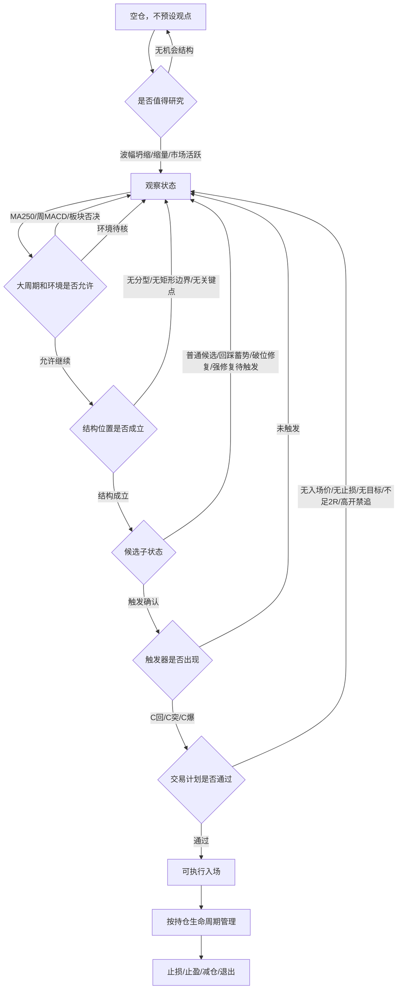

# C 信号 V2 设计契约

> 更新日期：2026-09-20<br>
> 当前状态：V2 已成为唯一主链；旧 C 策略层、composite 图面事件与旧 C/V2 展示切换已下线。P1-P12、P18、P19、P22、P23-A/P23-B/P23-C、P24、P25-A/P25-B/P25-C/P25-D 已完成第一阶段。当前策略版本为 `2026.09.20.1`，已纳入突破/破位 previous 口径、周线 MACD 完整周、宏观样本待核和三池工作台口径。<br>
> 依据：已完整阅读 `/Users/vainve/obsidian/奇衡-dk/以短线交易秘诀为生/` 原文笔记<br>
> 边界：本文只描述当前 V2 主链。旧 C 逻辑仅作为备用素材，单独记录在 `docs/legacy-c-signal-reference.md`，不得绕过 V2 许可层。

## 一、核心判断

现有 `C观 / C回 / C突` 不应继续通过叠加新指标来增强。正确方向是把 C 信号从“综合条件命中”重构为“交易决策状态机”。

原文反复强调三条约束：

1. 指标必须可量化、可证伪、可回测，否则不是规则；
2. 技术指标只是 trigger，不负责预测未来；
3. 没有完成收益风险比、格局、结构与触发前，不应产生交易动作。

因此 C 信号 V2 的设计目标不是“更多指标共同投票”，而是让每个模块只回答一个问题：

```text
是否值得看？
是否值得做？
是否允许做？
结构位置在哪里？
此刻是否触发？
错了在哪里退出？
```

## 二、当前决策链



这条链路的关键不是顺序漂亮，而是权限分明：

- 观察信号不能越权变成买点；
- 结构事实不能越过许可层；
- 触发信号不能越过交易计划；
- 风险信号不能被解释成“再等等”；
- 单股页可以保留 C 信号分析，但交易许可必须由 V2 漏斗决定。

## 三、当前已落地范围

| 阶段 | 状态 | 有效结论 |
|---|---|---|
| P1 独立许可 | 已完成 | 旧 `composite_entry` 不再直接决定 V2 可执行许可 |
| P2 Plan Gate | 已完成 | 入场类信号必须检查入场价、止损、目标和至少 2R |
| P3 扫描入池 | 已完成 | 工作台由 V2 当前状态独立入池，旧 C 不再作为主链入池来源 |
| P4 事实层修正 | 已完成 | 已有 Williams 分型、矩形 C 点、严格攻击日、缺口回补、动能事实第一版 |
| P5 环境许可 | 已完成 | 板块/概念/市场宽度从加分项升级为许可层 |
| P6 统一交易闸门 | 已完成 | `C回 / C突 / C爆` 共用同一个 Plan Gate |
| P7 目标价结构 | 已完成 | `C回` 使用箱体上沿，`C突/C爆` 使用上方结构阻力 |
| P8 宏观否决 | 已完成 | `C突/C爆` 被 MA250/周 MACD 否决，`C回` 被 MA60 下行否决 |
| P9 多周期矩形 | 已完成最小实现 | 已实现 K 线包含处理、短线/波段/一年级别矩形候选、active rectangle 与破底翻识别 |
| P10 阻力强度 | 已完成最小实现 | 已实现 `resistance_zones`、强度评分、目标选择理由和强阻目标选择 |
| P11 Exit Gate | 已完成最小实现 | 已实现持仓生命周期、防守线、强阻减仓建议和 S 点语义 |
| P12 图面重构 | 已完成最小实现 | 已接入 `marker_role`，将观察点、B 点、减仓点、S 点分层展示 |
| P17-A 验证链路 | 已归档 | 旧 C/V2 事件覆盖审计随旧 C 下线，不再作为当前主链验收项 |
| P17-B 验证性能 | 已完成最小实现 | 扫描路径已改为复用 V2 当前状态，避免逐 K 线历史回放拖慢全市场重刷 |
| P18 工作台原因过滤 | 已完成最小实现 | 工作台支持按 Plan、宏观否决、MA、2R、追高、过热、止损和 C 信号类型筛选 |
| P19 修复观察 | 已完成最小实现 | `bottom_div / C修` 已进入独立 V2 修复观察，不再与入场许可混用 |
| P25-A 候选子状态 | 已完成第一阶段 | `C候` 已拆成普通、回踩蓄势、破位修复、强修复待触发、反包确认，并输出通俗短标 |
| P25-B 强反包样本复盘 | 已完成第一阶段 | 已从 2026-09-11 至 2026-09-14 样本中提炼 `无短箱体 + MA250 上方 + 修复异动 + 15% 内强目标` 的 `待触` 观察条件 |
| P25-C 双视角图面 | 已完成第一阶段 | 单股页已支持空仓/持仓切换；空仓不显示卖/减，持仓才显示撤/卖/减 |
| P25-D 触发解释 | 已完成第一阶段 | `待触` 已输出确认价、失效价、盘中/次日观察规则和失败处理 |

当前真实 source：

```text
facts.source = c_signal_v2_p19_repair_watch_facts
state.source = c_signal_v2_p19_repair_watch
```

## 四、信号分层

### 事实层

事实层只记录可计算观察，不做买卖判断。

| 事实 | 回答的问题 | 当前状态 |
|---|---|---|
| Williams %R 50 中轴 | 价格重心在区间上半还是下半，是否穿越中轴 | 已实现事实层 |
| 多空力度 | 单根/短期 K 线里买方或卖方留下的距离 | 已实现事实层 |
| 威廉时钟 | 波幅是否坍缩，是否值得开始研究 | 已有第一版 |
| MA20/MA60/MA250 | 格局参照与趋势过滤 | 已接入宏观门禁 |
| 分型/双分型 | 结构低点/高点是否可定义 | 已实现第一版，待包含关系强化 |
| 矩形边界 | 成本区、突破位、C 点止损 | 已实现 P9 多周期候选和破底翻结构事实 |
| 攻击日/阴包阳 | 极端情绪和触发结构 | 已实现第一版，待样本消融 |
| 底背离修复 | 底背离后是否出现右侧修复，而非是否可以买 | 已实现 P19 独立 `repair` 事实 |
| 成交量 | 市场是否值得关注，不能单独决定买卖 | 部分已有，待与阻力强度联动 |
| 板块/概念共振 | 是否有外部环境支持 | 已接入环境许可，仍需校准 |

### 状态层

状态层把事实组合成“当前局面”，但仍不直接交易。

| 状态 | 定义 | 允许的下一步 |
|---|---|---|
| `researchable` | 波幅坍缩、缩量、市场/板块活跃，或出现极端观察事实 | 进入观察 |
| `structure_candidate` | 分型、双底、矩形、阴包阳等结构出现 | 等待许可和触发 |
| `pullback_setup` | 大方向未坏，价格回到可执行区域 | 等待回踩触发 |
| `breakout_setup` | 价格靠近关键上沿或起爆点，结构可证伪 | 等待突破触发 |
| `repair_setup` | 下跌后出现修复迹象，但还未进入可执行状态 | 继续观察 |
| `weak_repair_candidate` | 破位区出现底分型、低点收敛或修复苗头，但尚未站回关键位 | 标记 `候?`，等待右侧确认 |
| `strong_repair_watch` | 回踩/破位后出现强修复证据，次日可能进入反包确认 | 标记 `待触`，等待次日或盘中触发 |
| `reversal_confirmed` | 放量反包、站回防守线/箱体中轴/量峰压力等确认出现 | 进入触发层，再交给 Plan Gate |
| `macro_veto_blocked` | 入场触发出现，但长周期条件否决 | 降级观察 |
| `trigger_plan_waiting` | 触发出现，但目标或计划信息不足 | 补齐计划 |
| `trigger_plan_blocked` | 触发出现，但计划条件失败 | 放弃交易 |
| `risk_control` | 破位、计划失效或持仓风险触发 | 退出、减仓或暂停 |

### P25 候选子状态

`C候` 不能继续作为单一语义桶。2026-09-11 至 2026-09-14 的样本复盘显示，普通 `C候` 整体并不强，且容易被误解为买点；但其中存在少量“次日强反包/起爆”的前置结构，例如 `300903 科翔股份`、`301021 英诺激光`。这类样本不应在前一日提前标买，但必须从普通候选中分离出来。

候选子状态建议：

| 子状态 | 图面短标 | 含义 | 是否买点 | 下一步 |
|---|---|---|---|---|
| `structure_candidate` | `候` | 有分型、矩形或结构边界，但触发不足 | 否 | 等待触发 |
| `pullback_setup` | `候` | 回踩蓄势，价格回到可观察区域 | 否 | 等回踩触发 |
| `weak_repair_candidate` | `候?` | 破位区出现底分型或低点收敛，旧结构已破，新结构未确认 | 否 | 等站回防守线或中轴 |
| `strong_repair_watch` | `待触` | 回踩或破位后出现强修复证据，次日可能反包 | 否 | 设定次日/盘中触发价 |
| `reversal_confirmed` | `触` | 放量反包、站回关键位或突破量峰压力 | 不是最终买点 | 进入 Plan Gate |
| `entry_ready` | `买` | 触发确认且 Plan Gate ready | 是 | 建立持仓生命周期 |

约束：

- `C候` 本体不进入可执行买点；
- `候?` 不能显示成买点，只能说明“破位后的第一根修复观察 K”；
- `待触` 必须给出待确认条件，例如站回防守线、突破前一日高点、突破箱体中轴或突破量峰压力；
- `触` 只是触发事实，仍必须经过 Plan Gate；
- `买` 只能来自 Plan Gate ready。

P25-B 第一阶段补充：

- 2026-09-11 的 `C候` 整体至 2026-09-14 弱于全市场，但强反包并非完全随机；
- 当前暂把一类“无短箱体修复待触发”纳入 `strong_repair_watch`：短线箱体不可用、`repair_impulse = true`、价格位于 MA250 上方、上方 15% 内存在强目标阻力且 `strength_score >= 90`；
- 该规则在 2026-09-11 样本中命中 23 只，至 2026-09-14 平均收盘收益 `+3.883%`、胜率 `65.22%`、10% 以上样本 4 只；
- 这仍然不是买点，只说明“次日值得盯确认价”，确认价优先取强目标价；
- `300903` 属于 `触 / reversal_confirmed` 但 Plan Gate 因 2R 不足拦截，不能提前改成买；
- `301132 / 300112` 属于 `待触 / strong_repair_watch`；
- `301021` 暂仍归为 `候 / pullback_setup`，需要后续 P25-D 用次日突破确认价解释；
- `688383` 暂仍归为普通结构候选，不因事后大涨倒推升级。

### 许可层

许可层使用排除法，不使用简单加分法。

| 许可结果 | 含义 |
|---|---|
| `forbidden` | 不允许交易，只能观察或风控 |
| `watch_only` | 可以关注，但不允许入场 |
| `structure_only` | 结构可跟踪，但没有可执行触发 |
| `pullback_allowed` | 只允许回踩参与，不允许追突破 |
| `breakout_allowed` | 允许突破参与，但必须过交易计划 |
| `attack_allowed` | 允许攻击日/起爆计划，但必须过交易计划 |
| `risk_only` | 只处理风险，不寻找新入场 |

许可层吸收三重滤网思想：大周期只负责排除方向；交易周期只负责上膛；更小级别或明确价格突破才扣扳机。

## 五、C 信号行为契约

| 信号 | 中文名 | 类型 | 是否交易 | 必须字段 |
|---|---|---|---|---|
| `C研` | 值得研究 | 观察 | 否 | 观察理由、触发事实、失效条件 |
| `C候` | 候选结构 | 候选 | 否 | 结构类型、关键高低点、失效条件 |
| `C修` | 修复观察 | 候选 | 否 | 修复依据、待确认条件、失效条件 |
| `C回` | 回踩参与 | 入场 | 是 | 入场价、止损价、目标价、2R、仓位 |
| `C突` | 突破触发 | 入场 | 是 | 突破价、止损价、目标价、追高风险、仓位 |
| `C爆` | 起爆/攻击日 | 入场 | 是 | 触发价、结构止损、目标价、收益风险比、仓位 |
| `C风` | 风险处理 | 风控 | 否 | 风险来源、处理动作、是否强制退出 |

关键修正：不是每类信号都需要止损价。只有“可执行入场”的信号必须有止损价。

```text
观察类：观察理由 + 失效条件
候选类：结构位置 + 待触发条件 + 失效条件
入场类：入场价 + 止损价 + 收益风险比 + 仓位
风控类：风险来源 + 处理动作
```

### `C研` 值得研究

用途：降低交易频率，只提示“这里开始值得看”。

来源：

- 威廉时钟进入坍缩或倒计时；
- 缩量持续，参与者减少；
- 市场或板块出现明显活跃；
- 阴包阳创新低等观察开关出现。

禁止：

- 不得生成买入建议；
- 不得显示仓位；
- 不得因为“值得研究”进入参与候选主池。

### `C候` 候选结构

用途：说明某只股票已有可跟踪结构。

来源：

- 底分型/顶分型观察事实；
- 两个底分型形成低点抬高；
- 矩形边界可识别；
- 阴包阳创新低后出现右侧观察点。

要求：

- 必须说明结构高低点；
- 必须说明观察失效条件；
- 可以进入候选详情，但默认不进入“可参与”队列。

P25 补充：

- `C候` 必须输出子状态，不再只给一个泛化标签；
- 普通结构候选和强修复待触发必须区分排序、筛选和解释；
- 破位区底分型显示为 `候?`，表达“旧结构已破，新结构待确认”；
- 回踩蓄势显示为 `候`，但详情必须说明还缺哪个触发；
- 强修复待触发显示为 `待触`，详情必须给出次日或盘中确认价。

### `C修` 修复观察

用途：标记“底部或弱势后的右侧修复正在出现”，但还没有进入可执行交易。

语义澄清：

- `C修` 不是旧 C 策略中的原始信号名称；
- 它是 V2 新增的观察/候选状态，用来承接旧 `C观` 中“修复值得继续看”的合理部分；
- 当前 `C修` 由 V2 facts 的 `repair.stage = repair_setup` 生成，不依赖旧 `composite_confirm`；
- `C修` 不生成入场计划，不要求入场止损价，也不能直接升级为买点。

定义：

- 下跌或弱势后出现修复痕迹；
- 可能有底背离、低点抬高、MACD 修复、%R 中轴改善；
- 但尚未满足入场触发和交易计划。

要求：

- 默认放在修复观察池；
- 不与 `C回 / C突 / C爆` 同权；
- 只有后续触发成立，才转换成入场类信号。

### `C回` 回踩参与

用途：趋势或结构许可后的回踩低吸。

必须满足：

- 许可层不是 `forbidden`；
- MA60 已确认上行，或样本不足时明确提示待核；
- 趋势或结构没有破坏；
- 价格回到可定义支撑或结构区；
- 入场价、止损价、目标价、收益风险比可计算；
- 仓位不超过风险预算。

解释规则：

- `%R 50-80` 或空头力占优不必直接警告，可能代表回踩空间；
- `C回` 的目标可以使用短线或波段箱体上沿；
- 若跌破结构失效位，应立刻转入风险处理。

### `C突` 突破触发

用途：关键位突破后的右侧参与。

必须满足：

- 有明确突破位，例如近高、矩形上沿、昨日高点、起爆点；
- 不使用“有效突破”这类未来函数；
- 突破即触发，但必须有止损；
- 价格不能处在 MA250 下方；
- 周线 MACD 不能死叉向下或空方扩张；
- 若次日高开、当日涨幅过大、距 MA20 过远或过热分过高，交易计划可给 `waiting/forbidden`。

解释规则：

- `%R 下穿 50` 对 `C突` 有确认价值；
- `%R < 20` 不应额外加分，应视为接近高位后的追价风险；
- `C突` 的目标价不能使用已经被突破的箱体上沿，必须使用上方结构阻力。

### `C爆` 起爆/攻击日

用途：把原文里最明确的 trigger 独立出来。

来源：

- 起爆点：`今日开盘 + (昨日最高 - 昨日收盘) * N`；
- 攻击日：阳线、吞没阴线、突破吞没阴线高点；
- 三重滤网第三层：拟买入状态下突破昨日高点上一档。

必须满足：

- 触发价明确；
- 结构止损明确；
- 目标价必须来自上方结构阻力；
- 收益风险比至少 2R，优先 3R；
- 价格不能处在 MA250 下方；
- 周线 MACD 不能死叉向下或空方扩张；
- 如果风险空间过大，直接放弃，而不是缩小止损。

### `C风` 风险处理

用途：处理风险，不负责发现机会。

来源：

- 跌破结构低点、矩形 C 点、MA20、计划止损或持仓动态防守线；
- 顶背离、过热回落等风险事实升级为交易风险；
- 持仓从峰值回撤触发减仓；
- 双向大幅波动，方向未分。

重要边界：

- 顶分型本身不是 `C风` 强制退出，只是观察事实；
- 未跌破防守线时，顶分型不能直接生成 S 点；
- 风险信号优先级高于入场信号；
- P11 后，真正的 S 点应由 Exit Gate 统一生成。
- 无持仓时，`C风` 不得直接翻译成 `卖`；
- 无持仓时，触及强阻不得直接翻译成 `减`，应显示为 `阻` 或 `勿追`。

## 六、旧信号备用参考边界

旧 C 已不再是当前系统主链，不再决定扫描入池、图面主标记、交易许可或 Plan Gate。保留旧逻辑的目的只有一个：作为历史策略素材，后续判断其中哪些经验可以被 V2 facts 吸收。

备用文档：

```text
docs/legacy-c-signal-reference.md
```

使用规则：

- 可以参考旧 C 的信号意图，例如回踩、突破、底背离、顶部风险和止盈保护；
- 不得恢复 `composite_*` 作为 V2 入池或许可来源；
- 如果旧逻辑要重新吸收，必须先翻译成 V2 facts，再经过 V2 状态层、许可层、Plan Gate 和 Exit Gate；
- 旧 C 的历史回测结论只能作为假设来源，不能直接作为当前策略有效性证明。

P21 第一阶段已新增 `facts.legacy_experience`：

- 只输出旧 C 经验素材是否命中；
- `grants_permission=false`，不参与扫描入池、许可、Plan Gate 或 Exit Gate；
- 当前素材分为低风险回踩、底部修复、风险提示三类；
- 前端只以“旧C...素材”展示，避免被误读为旧 C 主链恢复。

## 七、评分规则

V2 不取消评分，但改变评分职责。

当前评分容易被理解为“分高就能买”。V2 里评分只能服务排序和解释，不能越过许可层与交易计划。

建议拆分：

| 分数 | 职责 |
|---|---|
| `research_score` | 值不值得看 |
| `structure_score` | 结构是否清楚 |
| `permission_state` | 是否允许交易，非线性枚举 |
| `trigger_quality` | 触发质量 |
| `execution_risk` | 执行风险 |
| `plan_quality` | 收益风险比、止损、仓位是否合格 |

其中 `permission_state` 不应是简单数值。被 `forbidden` 拦截后，任何高分都不能进入可参与队列。

## 八、交易计划门

`C回 / C突 / C爆` 都必须进入统一 Plan Gate。

当前规则：

```text
缺少入场价：blocked
缺少结构止损价：blocked
止损价不低于入场价：blocked
止损距离超过 8%：blocked
缺少目标空间：waiting
收益风险比低于 2R：blocked
收益风险比达到 2R：ready
默认单笔风险预算：2%
```

突破/攻击型额外规则：

- 当日涨幅过大，阻止追价；
- 距 MA20 过远，阻止追价；
- 过热分过高，阻止追价；
- 量能不足进入等待；
- 量比过大进入警示。

回踩型额外规则：

- MA60 已可计算且未上行时，宏观门直接否决；
- 过热或放量过急先作为警示，不一刀切禁止；
- 目标优先使用当前有效箱体上沿。

## 九、环境与宏观否决

环境许可不制造买点，只能允许、降级或阻止可执行升级。

### 板块/概念许可

读取：

- `sector_score / concept_score`；
- `sector_market_score / concept_market_score`；
- `sector_width_score / concept_width_score`；
- `opportunity_count / bottom_div_count / risk_count`。

输出：

- `v2_environment_permission`；
- `v2_effective_permission`；
- `v2_sector_permission / v2_concept_permission`；
- `v2_environment_effect`；
- `v2_environment_block_reasons / v2_environment_warnings`。

### 个股宏观否决

输出：

- `v2_macro_veto_permission / label / tone / reason`；
- `v2_macro_veto_block_reasons / warnings`。

规则：

| 入场类型 | 否决条件 |
|---|---|
| `C突 / C爆` | 价格确认低于 MA250 |
| `C突 / C爆` | 周线 MACD 死叉向下、绿柱扩大或刚跌入空方 |
| `C回` | MA60 已可计算但未上行 |

样本不足时不直接禁止，但必须进入解释或人工核对提示。

## 十、结构目标价

P7 已完成目标价第一版：

- `C回`：优先使用箱体上沿作为目标价；
- `C突 / C爆`：使用上方结构阻力；
- 外部传入 `target_price / expected_target_price` 时优先使用外部目标；
- 找不到突破型上方目标时，进入 `trigger_plan_waiting / watch_only`，不再用箱体上沿错误封杀。

当前突破目标来源：

- 上方未回补缺口下沿；
- 120 日前高；
- 60 日前高；
- 250 日前高。

当前边界：

- 还没有成交密集区/筹码峰目标；
- 还没有人工目标价输入 UI；
- 还没有阻力强度评分；
- 过近强阻和弱阻力跳过逻辑放到 P10。

## 十一、P9 多周期矩形

状态：P9-A/P9-B/P9-C 已落地。

V2 中的矩形不应只被理解为一段固定窗口的价格框，而应定义为：

```text
矩形 = 一段时间内价格在可识别上下边界之间反复交换，形成的可证伪成本区。
```

矩形的职责不是直接制造买点，而是提供：

- 成本区：判断筹码是否经过充分交换；
- 突破位：判断 `C突 / C爆` 是否突破关键压力；
- 回踩目标：为 `C回` 提供箱体上沿或支撑确认；
- C 点/失效价：为 Plan Gate 提供结构止损；
- 大结构位置：判断当前短线触发是在大箱体下沿、中位、上沿，还是已突破大箱体。

### 多周期候选

当前代码里的 `build_rectangle_facts()` 默认取近 20 根 K 线，属于短线箱体事实。后续不应简单把窗口从 20 改成 250，而是新增多周期候选结构：

```text
rectangle_candidates
  short_rectangle: 10 / 15 / 20 / 30 日，用于短线 C回/C突/C爆
  swing_rectangle: 30 / 40 / 60 日，用于波段平台确认
  macro_rectangle: 120 / 180 / 250 日，用于一年级别大平台与长期成本区
```

最终由 `active_rectangle` 给交易决策层使用：

```text
active_rectangle = 当前最适合解释本次信号的矩形
```

### 质量判断

选择 `active_rectangle` 时不能只看宽度，还要看结构质量：

- 宽度是否合理：短线箱体应更窄，大周期箱体可适度放宽；
- 上沿触碰次数：压力位是否被多次验证；
- 下沿/收盘支撑触碰次数：支撑是否被多次确认；
- 箱体内是否有往返换手，而不是单边下跌；
- 最新价格位置：下沿、中位、上沿、突破后、跌破后；
- 量能是否收缩后再释放；
- 是否存在异常插针，C 点应优先取有效收盘支撑，而不是机械最低影线。

### K线包含处理

机械扫描顶底分型之前，事实层必须先处理相邻 K 线的包含关系。否则箱体边界、C 点、顶底分型和观察标记会被异常长影线放大噪音。

处理原则：

- 同时识别后一根包含前一根、前一根包含后一根两类关系；
- 合并方向由当前局部趋势决定，趋势不明时使用最近有效分型或收盘中枢辅助判断；
- 向上合并时保留更高高点和更高低点，向下合并时保留更低高点和更低低点；
- 合并后的 K 线用于分型、矩形边界和 C 点事实识别；
- 必须保留 merged candle 到原始日期/index 的映射，避免图面标记落在错误交易日；
- 原始 OHLC 不应被覆盖，前端和回测仍可展示真实行情。

P9-A 最小验收标准：

- facts 输出 `structure.normalized_bars`，包含原始数量、处理后数量、包含次数、合并次数、原始日期/index 映射；
- 顶底分型基于处理后的序列计算；
- 每个分型能回溯到原始 K 线日期；
- 单股页现有 C 信号分析保留，并能解释是否发生过包含合并。

### 破底翻 / 洗盘恢复

破底翻不是 Plan Gate 的职责。它应由事实层识别为 `bear_trap_recovery`，再由状态层解释为新的 `C突 / C爆` 候选；Plan Gate 只校验该候选是否具备入场价、止损价、目标价、2R、追价风险和仓位风险预算。

建议事实条件：

- 观察期内价格轻微跌破短线或波段矩形下沿；
- 跌破幅度在参数阈值内，例如 `break_pct <= 3%`；
- 在有限恢复窗口内重新站回箱体，例如 `recover_days <= 3`；
- 恢复日收盘价重新站上箱体下沿或中位，且不能继续放量下杀；
- 后续突破箱体上沿或攻击日成立，才可进入 `C突 / C爆` 解释；
- P8 宏观否决仍然有效，MA250 下方或周线转空不能因为破底翻而豁免。

生命周期边界：

- 破底翻成立后，应废弃旧跌破状态下生成的临时观察防守线；
- 是否生成新的 B 点由 Plan Gate 决定；
- 是否清理旧持仓防守线属于 P11 Exit Gate 的持仓生命周期问题，不在 P9 直接处理。

### 一年级别矩形职责

`macro_rectangle` 是战略结构背景，不是入场触发器。

它主要回答：

- 标的是否在一年级别平台中长期换手；
- 短线 `C突 / C爆` 是否刚好发生在大箱体上沿；
- 短线 `C回` 是否是在大箱体突破后的回踩确认；
- 当前突破是否只是大箱体中位的小波动；
- 当前价格是否跌破一年箱体下沿，导致所有短线触发都应降级观察；
- 突破后的目标价是否应该使用更长期阻力，而不是短线箱体上沿。

建议语义：

| 场景 | V2 解释 |
|---|---|
| 短线 `C爆` 突破一年箱体上沿 | 强结构候选，允许进入 Plan Gate |
| 短线 `C爆` 仍在一年箱体中部 | 普通触发观察，不应当作强突破 |
| 短线 `C爆` 在一年箱体下沿附近 | 反弹观察，除非后续重新站回结构 |
| 价格跌破一年箱体下沿 | 大结构失效，入场信号降级 |
| `C回` 回踩一年箱体上沿不破 | 高质量回踩候选，但仍需 2R 和风险预算 |

### P9-B 已落地契约

- facts 中输出 `rectangle_candidates / active_rectangle / macro_rectangle`；
- 短线、波段、一年候选都带有 `lookback / upper / lower / mid / width_pct / c_point / touch_count / latest_position / quality_score`；
- 候选同时输出 `previous_upper / previous_lower / breaks_previous_upper / breaks_previous_lower`，并已作为突破触发与破位风险的核心参照；
- `active_rectangle` 明确说明选择原因；
- `C回` 默认使用短线或波段矩形，不直接使用一年矩形当短线止损；
- 单股页现有 C 信号分析保留，只新增结构解释，不删除旧对照。

### P9-C 已落地契约

- `bear_trap_recovery` 识别破底翻事实；
- `C突/C爆` 能结合 `macro_rectangle.previous_upper / breaks_previous_upper` 解释是否突破一年箱体上沿；
- 跌破 `macro_rectangle.previous_lower` 或 `macro_rectangle.lower` 时，环境层或结构层必须给出降级理由；
- 破底翻成立后清理观察期旧防守线，持仓期防守线仍交给 P11 Exit Gate。

## 十二、P10 阻力强度与目标价升级

状态：已完成最小实现。

P7 已经把 `C回` 与 `C突/C爆` 的目标价分开，但目标结构仍然比较粗。P10 需要给阻力加权，避免把所有前高一视同仁。

建议新增：

```text
resistance_zones
  source: prior_high / gap / macro_rectangle_upper / volume_peak
  price
  date_range
  touch_count
  volume_weight
  distance_pct
  time_decay
  strength_score
  role: target / warning / ignore
```

核心原则：

- 弱阻力不应阻止合理交易，也不应被当成真实目标价；
- 强阻力可以作为 Plan Gate 的目标价、减仓点或主动止盈点；
- 一年矩形上沿、历史天量套牢区、未回补缺口，应比普通小前高权重更高；
- 如果最近阻力太弱，Plan Gate 可以跳过它，选择更上方的核心强阻；
- 如果最近阻力很强且距离过近，Plan Gate 应降低赔率或进入等待。

P10 最小验收标准：

- `target_structure` 不再只列前高，而是输出结构化 `resistance_zones`；
- 每个阻力区有 `strength_score`、`role`、`touch_count`、`volume_weight`、`distance_pct` 与 `time_decay`；
- Plan Gate 的目标价选择能说明“为什么选这个阻力，而不是最近那个弱阻力”；
- `C突/C爆` 的 2R 计算使用核心强阻；
- 过近强阻通过 2R 闸门进入等待或禁止；
- 强阻撞击后的主动止盈只生成建议，不直接替代 P11 的持仓退出状态机。

## 十三、P11 Exit Gate

状态：已完成最小实现。

旧系统在离场风控上容易将微观事实直接等同交易指令。例如顶分型本身只是局部阻力或动能停顿，不应在主升浪中直接变成 `C风` 或 S 点。

Exit Gate 的目标是把风险事实、持仓状态和退出动作分开。

当前最小实现：

- `facts.exit_gate.position_lifecycle` 记录最近一笔持仓生命周期；
- `trailing_stop` 记录当前动态防守线；
- 顶分型进入 `observations`，只作为 `marker_role = observe`；
- 触及 P10 核心强阻只生成 `scale_out`，不直接替代 S 点；
- 跌破动态防守线或明确旧离场事实承接时，才生成 `marker_role = sell`。

### B/S 点与观察点分离

观察点只陈述事实：

- 顶分型：局部阻力或动能停顿；
- 底分型：局部支撑确认，可作为上移防守线备选锚点；
- 弱阻力：提示可能减速，但不直接触发退出。

交易指令由决策层生成：

- B 点：仅在 Plan Gate 全量通过且触发时打出；
- S 点：仅在多头结构被实质性破坏，或触发终极止盈时打出；
- Scale Out：撞击强阻或过热极态时，可以生成减仓建议，但需要和 S 点分离。

### 无持仓与有持仓双视角

P25 后，图面不能只按技术事实决定买卖字样，必须先判断用户处境或系统模拟持仓生命周期。

无持仓视角只回答“是否值得看、是否危险、是否不宜追”：

```text
看 / 候 / 候? / 待触 / 触 / 阻 / 警 / 破
```

有持仓视角才回答“仓位该怎么处理”：

```text
持 / 减 / 撤 / 卖
```

映射规则：

| 技术事实 | 无持仓显示 | 有持仓显示 |
|---|---|---|
| 顶分型、强阻接近、量价过热 | `阻` 或 `警` | `减` 或 `撤` |
| 跌破防守线、结构失效 | `破` | `卖` |
| 破位区出现底分型 | `候?` | 已退出后显示 `空仓观察`，未退出时仍先看防守线 |
| 回踩蓄势但未触发 | `候` | `持` 或 `撤`，取决于是否破坏原持仓防守 |
| 次日反包确认 | `触` | `持` 或 `加仓待计划`，仍需 Plan Gate |

核心原则：

- 没有系统确认的 `买` 或用户持仓上下文，不显示 `卖`；
- 没有仓位，不显示 `减`；
- `破` 是结构事实，不等于交易动作；
- `卖` 是持仓动作，只能来自有效持仓生命周期中的防守线失效；
- `撤` 应早于 `卖`，用于顶分型、转弱、接近防守线等主动降暴露场景；
- `卖` 是纪律兜底，不应成为第一条风险提示。

P25-C 第一阶段实现：

- 单股图表新增 `空仓 / 持仓` 切换，默认 `空仓`；
- 后端 `markerRole` 不改，继续保留真实事实层语义；
- 前端 `chartPositionDisplayMeta` 负责展示映射：空仓下 `sell -> 破/候?`、`scale_out -> 阻`，持仓下才显示 `卖/减/撤/持`；
- tooltip 保留原始事实来源，例如 `C风 V2防守离场`；
- 若同一交易日同时存在破位/离场事实与底部候选事实，空仓视角优先显示 `候? 破位修复观察`，用于表达“破位区底分型，先看修复质量”，不直接输出卖出动作。

P25-D 第一阶段实现：

- 状态模型新增 `candidate_trigger_plan`，只负责解释候选如何被确认或失效，不改变扫描入池、排序、Plan Gate 或交易许可；
- `candidate_trigger_plan.confirmation_price` 复用 `candidate_confirmation_price`，并补充 `confirmation_label`，例如结构触发价、回踩确认价、右侧确认价、触发确认价；
- `candidate_trigger_plan.invalidation_price` 复用结构失效价；
- `distance_to_confirmation_pct` 和 `distance_to_invalidation_pct` 用于让用户判断离触发/失效还有多远；
- `intraday_rule`、`next_session_rule`、`failure_rule` 分别说明盘中看什么、次日看什么、失败如何处理；
- `strong_repair_watch / 待触` 明确写入“当前仍不是买点”，只有后续突破确认价并转为 `触`，再通过 Plan Gate，才可能显示 `买`；
- 历史快照回填会在缺少 `candidate_trigger_plan` 时按既有 candidate 字段保守生成解释，避免旧数据打不开解释链路。

### 持仓生命周期

防守线不再是全局漂浮指标，而是绑定在单笔交易生命周期上的动态实例。

建议最小数据结构：

```text
position_lifecycle
  entry_id
  entry_date
  entry_type
  entry_price
  initial_stop
  active_stop
  stop_source
  peak_price
  position_state: inactive / active / scale_out / exited
  exit_reason
```

防守线规则：

- 激活：B 点打出时，以当前 `c_point` 或最近有效底分型初始化；
- 上移：只向更高的有效底分型或快线防守位移动；
- 不下移：一旦上移，绝不降低；
- 重置：S 点完成清仓后销毁，避免横跨多个周期形成残影。

### 阶梯式结构防守

常态趋势中，优先使用底分型阶梯防守：

- 当 `low[i-2] > low[i-1] < low[i]` 且后续价格继续上行时，确认 `i-1` 为有效底分型；
- 新底分型高于当前防守线时，防守线上移；
- 防守线保持水平，直到下一次有效上移或被跌破。

### 多档位自适应风控

解决直线暴涨后防守线过远的问题：

- 常态趋势防守：沿用底分型阶梯防守；
- 加速极态防守：当 `ma20_extended` 触发，或价格偏离底分型防守线过远时，切换为 MA5 或前三日最低点；
- 撞击强阻主动止盈：依赖 P10 `resistance_zones`，遇到强阻时可生成减仓建议。

## 十四、P12 图面重构

状态：已完成最小实现。

前端图面要表达决策层级，而不是把所有事件都画成同权买卖点。

建议后端输出语义字段，前端负责视觉样式：

```text
marker_role: observe / buy / sell / scale_out
marker_level: weak / normal / strong
marker_reason: top_fractal / bottom_fractal / plan_ready / trailing_stop_break / strong_resistance
```

图面原则：

- 观察点只做事实提示，不使用 B/S 视觉权重；
- B 点只来自可执行入场；
- S 点只来自 Exit Gate；
- V2 是唯一图面主视角，优先展示状态、许可、计划和风控；
- 旧 C 不再作为图面切换视角，只保留在备用文档中作为策略素材；
- 单股确认页保留 C 信号分析能力，但分析内容应以 V2 状态模型解释。

当前最小实现：

- 后端 mark point payload 输出 `markerRole / markerLevel / markerReason`；
- `buy` 使用强入场视觉，`sell` 使用强离场视觉；
- `scale_out` 使用中等权重减仓视觉；
- `observe` 使用轻量观察视觉，默认不显示图内标签；
- tooltip 和右侧事件流同步显示同一套语义，避免图表和解释面板口径不一致。

P25 待修正：

- `markerRole = sell` 必须绑定有效 `position_lifecycle.active` 或用户显式持仓；
- `markerRole = scale_out` 在无持仓视角降级为 `resistance/watch`；
- 单股页需要支持“无持仓/有持仓”显示切换；
- 候选池默认显示无持仓结构视角，避免把 `C候`、`C盈`、`C风` 误读成买卖建议；
- tooltip 保留原始 C 信号和事实来源，主图优先显示通俗状态字。

## 十五、后续执行顺序

当前 P1-P12 已完成策略漏斗、结构目标价、宏观否决、Exit Gate 和图面语义的最小闭环；P18/P19 已补上工作台原因过滤和 V2 修复观察状态。旧 C 已退出当前主链，后续不应继续堆叠新指标，而应把 V2 单链路的可达性、性能、参数消融和旧经验吸收做扎实。

建议顺序：

1. `P20-A`：恢复/确认 `bottom_div` 修复观察池在前端可达，避免 `C修` 被算出但不可见；
2. `P20-B`：已完成。单股首屏复用 V2 facts/events，避免日线图面、状态模型、交易计划和多周期摘要重复构建；
3. `P20-C`：已完成。新增 60m/4h 独立懒加载接口，首屏继续快返回，用户点击周期时再加载分时图；
4. `P20-D`：已完成。已基于 2026-09-11 当前快照重写市场刷新报告；
5. `P22-A`：已完成。工作台首屏瘦身，`/api/scan_workspace?lite=1&active_type=...` 只返回当前池 compact 候选，其他池保留计数并延迟加载；
6. `P22-B`：已完成。扫描历史建立快照日索引缓存，默认命中索引，`refresh=1` 时重建；
7. `P22-C`：已完成。数据源状态默认返回最近一次缓存，`refresh=1` 才做全量目录扫描；
8. `P22-D`：已完成。`/api/analyze/timeframes` 支持 `period=60m/4h`，前端点击哪个周期只请求并构建哪个周期的 chart；
9. `P23-A`：已完成第一阶段。建立 `build_v2_analysis_context()`，单股与扫描快照路径开始复用 facts/state/events/plan 上下文；
10. `P23-B`：已完成第一阶段。拆分 V2 合约与旧 C 备用 adapter，旧 C 只能作为备用翻译层；
11. `P23-C`：已完成第一阶段。单股 chart payload 默认去掉 old/new/opt，只在 `legacy=1` 或 `include_legacy=1` 备用对照时返回；
12. `P24`：已完成第三阶段。抽出前端 `analysisStore`，治理单股页异步周期加载、右侧面板和候选定位的全局状态耦合，旧裸全局分析态已移除；
13. `P25-A`：已完成第一阶段。候选子状态建模，把 `C候` 拆成普通结构候选、回踩蓄势、破位修复、强修复待触发、反包确认；
14. `P25-B`：已完成第一阶段。基于 2026-09-11 至 2026-09-14 样本复盘，抽取 `无短箱体 + MA250 上方 + 修复异动 + 15% 内强目标` 的 `待触` 观察条件；
15. `P25-C`：已完成第一阶段。图面双视角改造，无持仓不显示卖/减，有持仓才显示撤/卖/减；
16. `P25-D`：已完成第一阶段。新增次日确认/盘中触发解释，不把强修复待触发提前升级为买点；
17. `P21-A`：已完成第一阶段。旧 C 低风险回踩、底部修复、风险提示已翻译为 `facts.legacy_experience` 参考素材，明确不授予交易许可；
18. `P21-B`：已完成第一轮。`2026-09-11 -> 2026-09-14` 消融显示旧 C 素材整体区分度不足，低风险回踩/底部修复暂不进入入场加权，风险提示只保留给 Exit Gate 提前性研究；
19. `P21-C`：已完成第一轮滚动消融。三段窗口共 16500 条可评估样本，旧 C 素材整体覆盖过宽，不恢复入场加权；`strong_repair_watch / weak_repair_candidate` 仅保留为观察态；
20. `P21-D`：验证次日确认价是否能把 `待触/候?` 从观察态中筛出更稳定的 `触`，不从旧 C 字段继续加权。

代码耦合审计详见：

```text
docs/c-signal-v2-coupling-audit.md
```

当前快照重刷状态（版本演进：2026.09.09.2 → 2026.09.19.1 突破/破位口径修正 → 2026.09.19.2 周线 MACD 完整周修正 → 2026.09.20.1 宏观样本待核）：

- 已新增离线重建脚本 `scripts/rebuild_scan_snapshots_from_history_cache.py`，直接复用本地日线缓存和旧快照里的名称/行业/概念，避免全市场重刷逐只联网；
- 截至 2026-09-20 凌晨复核，本地最新工作台口径为 `2026-09-18` 数据、`2026.09.20.1` 策略快照：5499/5499 重建成功，旧策略快照 0；
- 当前工作台为三池一级入口：`opportunity / risk / bottom_div`；`bottom_div` 是修复观察池，不授予入场许可；
- `2026-09-11` 至 `2026-09-14` 复盘：严格 `trade_ready / plan_ready` 为 0；若误把 `C候` 当买点，2369 只可评估样本平均收盘涨幅 `+0.189%`、胜率 `48.92%`，弱于全市场 `+0.509%`、胜率 `56.08%`；
- P25-A/P25-B 第一阶段已基于 2026-09-11 快照兼容回填子状态：opportunity 池约为 `候? 527 / 候 1695 / 触 98 / 待触 50`；
- 该复盘结论支持后续 P25-C/D：`C候` 不能作为买点，强修复待触发必须从普通候选里分离出来，并且空仓/持仓图面语义必须拆开。
- 旧 `2026-09-09` P13 报告已被 `docs/c-signal-v2-market-refresh-report.md` 的当前口径替代，不再作为调参依据。

### P13 全市场重刷验证

目标：验证当前 V2 策略在全市场里到底筛出了什么，以及是否存在过严、过松或误杀。

当前状态：

- `P13-A` 的 2026-09-09 报告已变成历史口径；
- `2026-09-11` 工作台复核已变成历史口径；
- `2026-09-14` 工作台已确认：当前策略快照 5499，旧策略残留 0，`opportunity 2389 / risk 1417 / bottom_div 650`；
- 旧 C 事件不再产生当前入池结果，后续不再做“旧 C 是否被 V2 漏放”的主链审计；
- 当前市场报告已更新为 2026-09-14 口径，后续以 `docs/c-signal-v2-market-refresh-report.md` 为准。

后续重刷报告要求：

- 使用当前 V2 版本重新生成全市场扫描结果和工作台缓存；
- 统计 `C研 / C候 / C回 / C突 / C爆 / C盈 / C风` 的数量分布；
- 按 `markerRole = observe / buy / scale_out / sell` 统计图面语义分布；
- 统计 V2 拦截原因分布，包括宏观门、Plan Gate、2R 不足、强阻过近、追高、结构不成立；
- 旧 C 不进入当前市场报告主统计，只在 P21 旧经验吸收实验中作为样本假设；
- 当前市场报告只按前端工作台最终入池结果统计，不替代逐 K 线事件级审计；
- 每类至少抽样复核若干只股票：
  - V2 允许入场；
  - V2 结构候选；
  - V2 宏观否决；
  - V2 Plan Gate 拦截；
  - V2 强阻减仓；
  - V2 Exit Gate 离场。

交付物：

```text
docs/c-signal-v2-market-refresh-report.md
```

报告至少包含：

- 扫描时间；
- 股票样本数；
- 各信号数量；
- 各 marker role 数量；
- 各拦截原因数量；
- V2 内部状态分布与原因分布；
- 典型样本；
- 需要调参的问题。

历史结论摘要（2026-09-09 口径，仅存档）：

- 历史有效样本 5501 只，对应工作台有效事件 4569 条；
- opportunity 池 3934 条，其中 `trade_ready` 只有 3 条；
- `trade_ready` 中 `000166`、`000828` 为旧 C 回踩被 V2 放行，`688515` 为 V2 独立 C爆放行；
- 旧 C 入场可作为历史样本假设，但不能绕过 V2 许可；
- `C盈/C风` 的细分图面语义应读取 `facts.exit_gate.marker_role`，不能只看 `v2_role=risk`。
- P16 进一步确认：2026-09-09 旧机会入口 56 个，其中 49 个被 V2 拦截、6 个进入 `C修 / watch_only`、2 个 `C回` 通过 Plan Gate；差异主要来自 MA60、MA250、追高、过热、止损距离和 2R 的复合门禁。

当前结论摘要（2026-09-14 口径）：

- opportunity 池仍全部为 `C候`，不是可买名单；
- 2026-09-11 至 2026-09-14 复盘确认：误把 `C候` 当买点的整体表现弱于全市场；
- 少数强反包样本应进入 `strong_repair_watch / 待触` 研究，不应推动全部 `C候` 放宽；
- 空仓和持仓图面语义必须拆开，否则 `C风 / C盈` 会被误读成无持仓下的卖出或减仓动作。

### P14 策略参数校准

目标：让规则从结构上合理，继续推进到样本上也合理。

当前状态：`P14-A/P14-B` 已完成。只读敏感性实验报告见：

```text
docs/c-signal-v2-parameter-sensitivity.md
```

核心结论：

- 暂不建议直接调低 2R 或 8% 止损阈值；
- 单独放松 2R、止损上限或二者组合，当前反事实可通过数量仍为 3；
- 主要瓶颈是复合拦截：量能确认不足、过热、MA20 偏离、MA60/MA250 趋势门共同作用；
- `C回` 主要受 MA60 上行约束影响，25 条中只有 2 条 MA60 顺风；
- `C突` 主要受 MA250 趋势约束影响，20 条中 14 条位于 MA250 下方；
- 阻力强度 60 不是当前主要瓶颈，后续更应校准目标选择优先级。

待校准参数：

- `strength_score >= 60` 是否适合作为核心强阻阈值；
- `C回 / C突 / C爆` 是否都应该固定使用 2R 硬门槛；
- MA250 与周 MACD 宏观否决是否误杀低位反转；
- MA60 上行对 `C回` 是否过严；
- 一年矩形、历史量峰、缺口的阻力权重是否过高；
- 强阻减仓是否需要弱/中/强分级；
- 动态防守线是否上移过快或过慢；
- 加速态 MA5 / 三日低点防守是否需要更明确的启用条件。

当前决策：

- 暂不调低 2R；
- 暂不放宽 8% 止损距离；
- 暂不取消 `C回` 的 MA60 上行要求；
- 暂不取消 `C突/C爆` 的 MA250 与周 MACD 长周期防线；
- 后续改参必须进入 P20 组合消融，而不是直接凭样本数量调阈值。

校准原则：

- 先看 P13 样本，再调参数；
- 不能为了让历史结果漂亮而调参；
- 每个参数调整必须登记默认值、调整理由、影响范围和回滚方式；
- 不把调参结果直接写死成无法解释的魔法数。

### P15 工作台体验优化

目标：让工作台从扫描列表变成策略决策台，并确保工作台与单股页口径一致。

当前状态：`P15-A/P15-B/P18` 已完成最小实现：

- 候选卡片新增 V2 决策芯片：许可、Plan Gate、目标价、Exit role；
- 右侧候选详情新增 `V2闸门` 区块，拆出许可、Plan、目标、止损、宏观和 Exit；
- `C回` 目标优先展示箱体上沿，`C突/C爆` 目标优先展示上方结构阻力；
- `C盈/C风` 细分动作读取 `facts.exit_gate.marker_role`，用于区分观察、减仓和卖出；
- 单股页当前以 V2 为唯一视角，旧 C/V2 临时切换已下线；策略差异面板应改为展示 V2 当前许可、Plan、目标/止损、Exit 和旧逻辑备用参考，不再暗示旧 C 仍是并行策略。
- 工作台新增 V2 原因过滤，前端和候选分页接口均支持按 Plan、宏观、MA、2R、追高、过热、止损、信号类型和 Exit role 过滤。

核心需求：

- 候选卡片直接展示 V2 关键解释：
  - 当前状态；
  - 许可结果；
  - 拦截原因；
  - 目标价来源；
  - 止损价来源；
  - R/R；
  - 宏观门状态；
  - Exit Gate 状态；
  - `facts.exit_gate.marker_role`，用于区分观察、减仓和卖出；
- 已实现按原因过滤：
  - Plan Gate ready；
  - Plan Gate blocked；
  - 宏观否决；
  - MA60 / MA250；
  - 2R 不足；
  - 追高 / 过热 / 止损过宽；
  - `C回 / C突 / C爆`；
  - 风险池减仓 / 卖出；
- 如需使用旧 C 经验，只在文档和实验层做参考：
  - 旧 C 入场但 V2 拦截，作为“是否误杀”的样本假设；
  - V2 候选但旧 C 未出现，作为“是否过宽”的样本假设；
  - 风险点降级为观察，作为 Exit Gate 分级校准样本；
  - 这些假设必须先翻译为 V2 facts/gate，再进入回测或消融。
- 保证工作台进入单股页后，单股页能解释工作台上的同一个状态，不能出现列表说可参与、单股页说只观察。

当前不做：


- 不恢复旧 C 主链；
- 不把观察事实当作买卖建议；
- 不用 AI 主观总结替代结构化事实；
- 不做“有效突破确认”这类事后定义。

### P16/P17 事件覆盖审计（已随旧 C 下线）

原 P16/P17 审计目标是「旧 C 最新机会入口是否被 V2 漏放」，依赖旧 C 事件扫描。旧 C 策略层删除后，对应产物一并下线：

```text
scripts/audit_c_signal_v2_event_coverage.py    （已删除）
tests/test_audit_c_signal_v2_event_coverage.py （已删除）
docs/c-signal-v2-event-coverage-audit.md       （已删除）
```

历史结论（`2026.09.09.1` 口径，仅存档）：旧 C 最新机会入口 56 个，其中 2 个旧 `C回` 被 V2 放行为 `ready`，旧 `C突` 20 个全部被 V2 拦截，主要原因是 MA250 下方、止损距离超过 8%、距 MA20 过远、过热和 2R 不足。当前扫描已改为 V2 单一入池，不再产生旧 C 事件，该对比口径不再适用。

### 单股分析首屏性能

问题：输入股票代码后的 `/api/analyze` 会同步构建图面 payload 与 `multi_timeframes`。其中 60m/4h 图表序列化会调用 V2 事件构建；日线 V2 mark points 也曾对完整历史逐根重建 facts。在 `600063` 样本上，日线、V2 状态、交易计划和画像合计不足 0.15 秒，但 60m/4h 多周期层曾耗时约 57 秒，完整日线 V2 事件回放约 13.7 秒。

当前处理：

- `fetch_stock_minute_history()` 新增 `cache_only` 参数；
- 单股主请求调用多周期层时传 `allow_fetch=False`，只读已有分时缓存，不在首屏同步拉新浪分时；
- 即使命中 60m 缓存，首屏也只返回 60m/4h 轻量摘要，不生成分时图表 payload；
- 日线图面 V2 mark points 默认只生成最近 60 根 K 线；
- 前端在没有分时 chart 时不再永久禁用 60m/4h 图表按钮，而是允许点击后懒加载。

当前效果：

- `600063` 本地整函数计时从约 15-19 秒降至约 3.9 秒；
- 多周期首屏路径从约 56.8 秒降至约 0.17 秒；
- 该优化不改变 V2 策略判断、扫描入池和 Plan Gate，只改变首屏图面事件与分时图表的加载方式。

2026-09-12 实现补充：

- “重复计算”不是指重复联网，也不是同一只股票被分析两遍；它指同一份日线 DataFrame 在一次 `/api/analyze` 内多次构建 V2 facts/events；
- `fetch_and_process_data()` 当前先统一构建 V2 components/facts 与最近 60 根 V2 events，再传给图表 payload、V2 状态、交易计划和多周期日线摘要复用；
- `analysis_frame_to_chart_payload()` 已支持传入预计算的 `v2_events` 与 `facts`；
- `summarize_timeframe()` / `build_multi_timeframe_payload()` 已支持传入日线分数和最近事件，避免日线摘要二次执行 `build_v2_signal_events(lookback=60)`；
- 新增 `/api/analyze/timeframes?code=...`，用于点击 60m/4h 时再加载分时 chart；
- 前端周期按钮和多周期卡片支持“可加载 / 加载中 / 加载失败”状态，加载成功后自动切换到用户最后选择的周期。

2026-09-13 实现补充：

- `/api/analyze/timeframes?code=...&period=60m` 只返回 60m chart，不再同步构建 4H chart；
- `/api/analyze/timeframes?code=...&period=4h` 只返回 4H chart，不再同步构建 60m chart；
- `/api/analyze/timeframes?code=...` 不带 `period` 时保留兼容行为，仍返回 60m + 4H；
- 前端 `fetchAnalysisTimeframes(code, period)` 会随周期按钮传入目标周期；
- 前端分时加载状态由 `analysisStore.timeframeRequests` 按周期管理，60m 和 4H 可分别加载、分别缓存、分别失败提示。

2026-09-13 P22-D-2 实现补充：

- 新增分时 chart payload 磁盘缓存，路径为 `.cache/timeframe_charts/`；
- 缓存 key 包含股票代码、周期、事件窗口、策略版本、复权口径和 chart frame 指纹；
- `refresh=1` 可绕过缓存并重建 chart payload；
- 分时 chart 构建时复用同一次 V2 events/facts，summary 不再额外重建 V2 事件；
- 分时 chart 的 V2 图面事件窗口从 60 根收敛为最近 40 根，减少首次点击成本；
- 该优化只影响 60m/4H 图面展示性能，不改变日线 V2 主链、扫描入池、Plan Gate、Exit Gate 或工作台排序。

2026-09-12/13 实测：

| 项目 | 耗时 | 结论 |
|---|---:|---|
| `/api/analyze?code=600063` | test client 平均 3.091 秒；2026-09-13 P22-D-2 真实 5009 HTTP 3.299 秒 | 首屏只返回日线与轻量多周期摘要，不读取分时缓存，不返回 60m/4h chart |
| `/api/analyze/timeframes?code=600063&period=60m` | P22-D 拆分后、D2 前：8.559 秒；响应体 0.575 MB | 点击 60m 时只构建 60m chart，不返回 4H chart |
| `/api/analyze/timeframes?code=600063&period=4h` | P22-D 拆分后、D2 前：6.564 秒；响应体 0.136 MB | 点击 4H 时只构建 4H chart，不返回 60m chart |
| `/api/analyze/timeframes?code=600063` | P22-D 拆分后、D2 前：12.975 秒 | 兼容旧行为，一次加载 60m/4H；后续前端默认不再使用该全量路径 |
| `/api/analyze/timeframes?code=600063&period=60m&refresh=1` | 2026-09-13 P22-D-2 真实 5009 HTTP 2.362 秒；响应体 0.572 MB | 60m 单周期强制重建；V2 事件窗口 40 根 |
| `/api/analyze/timeframes?code=600063&period=60m` | 2026-09-13 P22-D-2 真实 5009 HTTP 0.164 秒；响应体 0.572 MB | 60m chart 缓存命中 |
| `/api/analyze/timeframes?code=600063&period=4h&refresh=1` | 2026-09-13 P22-D-2 真实 5009 HTTP 2.102 秒；响应体 0.116 MB | 4H 单周期强制重建；V2 事件窗口 40 根 |
| `/api/analyze/timeframes?code=600063&period=4h` | 2026-09-13 P22-D-2 真实 5009 HTTP 0.113 秒；响应体 0.116 MB | 4H chart 缓存命中 |
| `/api/analyze/timeframes?code=600063` | 2026-09-13 P22-D-2 真实 5009 HTTP 0.190 秒；响应体 0.687 MB | 兼容旧行为，60m/4H 都命中 chart 缓存 |
| `/api/scan_workspace?limit=120&lite=1&active_type=opportunity` | 强刷重建 8.696 秒；重启后磁盘缓存命中 0.578 秒；响应体 1.884 MB | 首屏只返回当前池 120 条 compact 候选；非当前池保留 count/has_more，切换时再加载 |
| `/api/scan_workspace?limit=120&lite=1&active_type=risk` | 预热后重启磁盘缓存命中 1.475 秒；响应体 1.895 MB | 强刷/冷建时会预热各池 compact 缓存，切换池子不再重建 workspace |
| `/api/scan_workspace?limit=120&lite=1&active_type=bottom_div` | 预热后重启磁盘缓存命中 0.507 秒；响应体 1.974 MB | 修复观察池同样走 compact 缓存；前端可见性仍属于 P20-A |
| `/api/scan_workspace/candidates?scan_type=opportunity&code=301539&detail=1` | 最终真实 5009 HTTP 0.173 秒；响应体 0.070 MB | 详情按代码直读快照并补画像/关系证据，不再重建 6000 条全池 |
| `/api/scan_history?limit=30` | 冷建索引 16.297 秒；最终索引命中 0.399 秒 | 历史默认读索引，`refresh=1` 才解析全部快照 |
| `/api/data_sources` | 冷刷新 37.228 秒；最终缓存命中 0.001 秒 | 默认返回最近一次治理状态，`refresh=1` 才全量扫描日线/快照目录 |

剩余性能需求：

- `P22-D-3`：如仍需压低首次点击时间，可继续做分时 chart 后台预热，或为 V2 facts 做增量/滚动计算；当前不建议继续缩短事件窗口以免图面解释过薄；
- `P22-E-2`：workspace 原始结构的增量索引。P22-E 第一阶段已完成 compact 响应持久缓存，但强刷重建仍约 8-10 秒，瓶颈仍在加载快照、构建板块/概念结构与排序解释；
- `P23-A-2`：继续把更多下游 priority/explanation/legacy debug 路径改为只读 V2 analysis context，避免局部函数自行重建 facts。

### P23-A V2 analysis context

目标：为同一只股票、同一份分析 frame 建立统一事实入口，避免单股、扫描、快照、交易计划各自重新构建 V2 facts/state。

当前状态：已完成第二阶段。

已实现：

- 新增 `stock_analyzer/v2_analysis_context.py`；
- `build_v2_analysis_context()` 统一返回 `components / facts / structures / williams_clock / trade_context / events / state / trade_plan / score_summary`；
- `build_v2_trade_context()` 统一把 `c_signal_v2_facts` 与 `technical_structures` 注入到 permission 和 trade plan 所需 context；
- 单股 `/api/analyze` 已改为通过 V2 analysis context 一次性复用 facts/events/state/trade_plan；
- 分时 `/api/analyze/timeframes` 已改为通过 V2 analysis context 获取日线 score summary，不再直接构建 state；
- `build_scan_snapshot()` 已改为每只股票只构建一次 V2 analysis context，再传给 `opportunity / risk / bottom_div` 三个扫描池；
- `scan_stock_frame()` 增加可选 `analysis_context`，旧调用不传时仍会自行构建 context，保持兼容。

2026-09-13 实测：

| 项目 | 耗时 | 结论 |
|---|---:|---|
| `build_scan_snapshot(600063)` 当前 context 复用路径 | 0.065 秒 | 一次 context 供三个池共享 |
| 旧式每个池单独 `scan_stock_frame()` + trade plan | 0.290 秒 | 同一只股票重复构建 V2 facts/state |
| `/api/analyze?code=600063` P23-A 后真实 5009 HTTP | 3.513 秒 | 单股首屏继续只返回日线与轻量多周期摘要 |
| `/api/analyze/timeframes?code=600063&period=60m` P23-A 后真实 5009 HTTP | 0.171 秒 | 60m chart 缓存命中 |
| `/api/analyze/timeframes?code=600063&period=4h` P23-A 后真实 5009 HTTP | 0.117 秒 | 4H chart 缓存命中 |
| `/api/scan_workspace?limit=120&lite=1&active_type=opportunity` P23-A 后真实 5009 HTTP | 0.493 秒 | 工作台 compact 缓存命中 |
| `/api/analyze?code=600063` P23-B 后真实 5009 HTTP | 3.148 秒 | V2 合约拆分后单股首屏未倒退 |
| `/api/analyze/timeframes?code=600063&period=60m` P23-B 后真实 5009 HTTP | 0.164 秒 | 60m chart 缓存命中 |
| `/api/analyze/timeframes?code=600063&period=4h` P23-B 后真实 5009 HTTP | 0.110 秒 | 4H chart 缓存命中 |
| `/api/scan_workspace?limit=120&lite=1&active_type=opportunity` P23-B 后真实 5009 HTTP | 0.459 秒 | 工作台 compact 缓存命中 |

剩余风险：

- 部分 priority/explanation/debug 路径仍可能在缺少 context 时自行补算 facts，这是兼容策略，不是最终架构；
- 全市场强刷的主要瓶颈还需要结合 P22-E-2 快照级增量索引继续处理。

### P23-B V2 contract 与旧 C adapter 拆分

目标：让 V2 主链合约与旧 C 备用翻译在代码层分离，避免旧策略看起来仍是并行主链。

当前状态：已完成第三阶段。

已实现：

- 新增 `stock_analyzer/c_signal_v2_contracts.py`，只保存 V2 原生事件的 signal/state/role/plan 语义；
- 新增 `stock_analyzer/legacy_c_signal_adapter.py`，只负责 `composite_*`、`old/new/opt` 旧事件到 V2 语义的备用翻译；
- `stock_analyzer/c_signal_v2.py` 不再直接承载旧 C 映射表，只保留状态机、许可、优先级等 V2 主链计算；
- `events.py / scanner.py / scan_snapshot.py / multi_timeframe.py` 已改为直接读取 adapter 的兼容出口；
- `c_signal_v2_fields()` 与 `c_signal_v2_mark_fields()` 仍保留兼容行为，避免旧缓存和测试调用断裂。

边界：

- 旧 C adapter 只服务历史缓存、备用参考和图面兼容；
- 当前扫描入池、交易许可、Plan Gate、Exit Gate 仍以 V2 facts/state/context 为主；
- 后续不能把 `composite_*` 重新作为主链入口，任何旧经验必须先翻译成 V2 facts/gate。

剩余风险：

- `build_c_signal_v2_state_from_result()` 仍需要识别 legacy key 以兼容旧缓存，这是有意保留的 adapter 边界；
- 前端仍有少量“策略对照/旧缓存”历史文案和字段依赖，需在 P24 继续清理。

### P23-C 单股 chart payload 去 legacy 默认值

目标：让单股图表 payload 默认只服务 V2 主链，降低响应体、计算量和用户对 old/new/opt 的认知噪音。旧 C 仍保留为备用参考，但必须显式请求。

当前状态：已完成第一阶段。

已实现：

- `analysis_frame_to_chart_payload()` 新增 `include_legacy=False` 默认参数；
- 默认 payload 只返回 `mark_points / mark_points_v2 / event_stats.v2 / score_summary / signal_definitions`；
- 默认 `mark_points` 已改为 `mark_points_v2` 的别名，避免前端继续读到旧 C 主图标记；
- `mark_points_old / mark_points_new / mark_points_opt / stats_old / stats_new / stats_opt` 默认不再返回；
- `/api/analyze?code=...` 默认只返回 V2 图面字段；
- `/api/analyze?code=...&legacy=1` 或 `include_legacy=1` 才返回 old/new/opt 备用对照字段；
- 60m/4H 延后加载图表 payload 也固定为 V2-only，并把 `include_legacy` 写入分时 chart cache key，避免旧缓存误命中。

2026-09-13 真实 5009 HTTP 实测：

| 接口 | 耗时 | 结论 |
|---|---:|---|
| `/api/analyze?code=600063` | 8.202 秒 | 默认无 old/new/opt 字段，`event_stats` 仅含 `v2`，`mark_points == mark_points_v2` |
| `/api/analyze?code=600063&legacy=1` | 6.846 秒 | 显式 debug 返回 `mark_points_old/new/opt` 与 `stats_old/new/opt` |
| `/api/analyze/timeframes?code=600063&period=60m` 首次 | 4.700 秒 | 构建 60m V2-only 图表，无 legacy 字段 |
| `/api/analyze/timeframes?code=600063&period=60m` 缓存命中 | 0.232 秒 | `timeframe_chart_cache_meta.hit=true` |
| `/api/analyze/timeframes?code=600063&period=4h` 首次 | 5.635 秒 | 构建 4H V2-only 图表，无 legacy 字段 |
| `/api/analyze/timeframes?code=600063&period=4h` 缓存命中 | 0.130 秒 | `timeframe_chart_cache_meta.hit=true` |

验证：

- `./venv/bin/python -m unittest discover -s tests`：195 tests OK；
- `./venv/bin/python -m compileall app.py stock_analyzer`：通过；
- `for file in static/js/*.js; do node --check "$file" || exit 1; done`：通过；
- `git diff --check`：通过。

### P24 前端 analysisStore

目标：把单股确认页的当前股票、当前周期、视图 payload、分时加载状态和异步请求 token 收敛到一个前端状态入口，避免旧响应覆盖新图表。

当前状态：已完成第一阶段。

已实现：

- 新增 `static/js/analysisStore.js`；
- `analysisStore.beginAnalysis()` 为每次单股分析生成 request id，旧请求返回后不能覆盖当前股票；
- `analysisStore.beginTimeframeLoad()` 为 60m/4H 延后加载生成独立 request id，切换股票后旧分时响应会被丢弃；
- 周期懒加载响应现在只补充 chart 数据；只有当用户最后选择仍是该周期时，响应才允许触发图表切换；
- `analysisStore` 统一保存 `rootData / viewData / activePeriod / timeframeRequests`；
- 已移除 `lastData / lastAnalysisData / activeChartPeriod / timeframeLoadPromises / timeframeLoadErrors` 旧裸全局分析态；
- `app.js` 的 `analyzeStock()` 已接入 analysis request token；
- `chartView.js` 的周期切换、分时懒加载、图表渲染和信号聚焦已优先读取 `analysisStore`；
- `signalPanel.js` 的图例筛选重绘、辅助确认卡片、交易计划和 V2 state 读取已优先使用 `analysisStore`；
- `scanStrategyCompare.js` 的策略视角切换重绘已优先使用 `analysisStore`；
- `templates/index.html` 已保证加载顺序为 `api.js -> analysisStore.js -> app.js`。

验证：

- 新增 `tests/test_frontend_analysis_store.py`，用 Node VM 验证旧单股请求、旧 60m/4H 请求不会污染当前状态；
- Node VM 已按关键脚本加载顺序验证 `analysisStore/app/signalPanel/chartMarkers/chartOptions/chartView/scanState/scanStrategyCompare` 顶层可执行，且不再创建旧全局分析态；
- Node VM 已覆盖“先点 60m、再点 4H、60m 后返回”时不会覆盖用户最后选择的 4H；
- `./venv/bin/python -m unittest discover -s tests`：198 tests OK；
- `for file in static/js/*.js; do node --check "$file" || exit 1; done`：通过；
- 页面实际 HTML 确认 `analysisStore.js` 位于 `api.js` 之后、`app.js` 之前。

剩余风险：

- 当前验证覆盖了 store 竞态模型、关键脚本加载和静态语法；
- Chrome headless 在当前环境下未能稳定退出，浏览器端点击链路 E2E 尚未形成自动化断言；
- 后续可继续补真实浏览器点击链路：输入代码、切 60m/4H、快速切股、回到日线、定位信号日。

### P22-E 工作台 compact 持久缓存

目标：让平台普通打开和池子切换不再依赖进程内短缓存，也不再每次冷启动都重建 workspace。

当前状态：已完成第一阶段。

已实现：

- 新增 compact workspace 响应持久缓存；
- 缓存 key 按 `start_date / snapshot_day / active_type / limit / replay_entry_model / overview_limit / pool_stats_limit / snapshot_dir / catalog_dir` 区分；
- 依赖指纹包含扫描快照目录、策略版本、快照 schema、解释版本、画像/概念/关系证据和板块行情缓存；
- 普通请求优先读磁盘 compact JSON；
- `refresh=1` 强制重建，并在拿到完整 workspace 后预热 `opportunity / risk / bottom_div` 各池 compact 缓存；
- 持久缓存只保存 web compact 响应，不保存 V2 中间事实，不改变策略计算权威源。

实测：

| 场景 | 耗时 | 说明 |
|---|---:|---|
| 强刷生成缓存 | 8.696 秒 | 仍走完整 workspace 构建 |
| 重启后 opportunity 命中 | 0.578 秒 | 磁盘 compact cache hit |
| 重启后 risk 命中 | 1.475 秒 | 磁盘 compact cache hit |
| 重启后 bottom_div 命中 | 0.507 秒 | 磁盘 compact cache hit |

剩余风险：

- 强刷/快照变化后的第一次构建仍慢；
- 依赖指纹需要 stat 大量快照文件，命中路径仍约 0.5-1.5 秒；
- 下一阶段若要把强刷也压低，需要做快照级增量索引，而不是继续压缩响应体。

### P18 工作台原因过滤

目标：让工作台不仅告诉用户“哪些进入候选”，也能快速定位“为什么被放行或拦截”。

当前状态：已完成最小实现。

已实现：

- 候选分页接口 `/api/scan_workspace/candidates` 新增 `reason` 参数；
- 后端候选过滤支持从 `v2_state_model / v2_permission_model / plan_gate / exit_gate` 聚合原因文本；
- opportunity 池支持筛选 `plan_ready / plan_blocked / macro_veto / ma60 / ma250 / rr / chase / heat / wide_stop / c_pullback / c_breakout / c_attack`；
- risk 池支持筛选 `heat / exit_scale_out / exit_sell`；
- 前端工作台新增原因 chip，切换后与行业、概念、搜索、排序一起参与本地过滤和后端分页加载；
- 搜索文本也纳入 V2 拦截原因，用户可以直接搜索 `MA250`、`2R`、`追高` 等关键词。

边界：

- P18 只解决“可见、可筛、可复核”，不改变策略判断；
- `MA250下方` 是结构事实/原因筛选，不等同于一票否决；真正被大周期硬拦截的样本应看 `宏观否决`；
- chip 上的数量来自当前已加载页，不替代全池统计；
- 是否放宽 MA60、MA250、2R、止损或追高阈值，仍要进入 P20 参数组合消融后再决定。

### P19 底背离与修复观察治理

目标：把 bottom_div 从旧 C 兜底迁移为 V2 的修复观察状态，并避免底背离被误解为入场。

当前状态：已完成最小实现。

已实现：

- facts 新增 `repair` 对象，输出 `stage / evidence / invalidation_price / required_confirmations / summary`；
- `stage = bottom_research`：只有底背离或近期底背离，信号为 `C研`；
- `stage = repair_setup`：底背离后出现修复异动、修复确认、MACD 柱改善、动能修复或低点抬高，信号为 `C修`；
- 新增 V2 事件 `v2_repair_watch`，用于 bottom_div 池独立展示 `C修`；
- bottom_div 池命中 `v2_repair_watch` 时阶段显示为“修复观察”；
- `C修` 明确 `requires_trade_plan = false`、`requires_stop_loss = false`，不生成入场计划；
- P19 初始策略版本为 `2026.09.09.2`；后续突破/破位、周线 MACD 和宏观样本待核版本演进见文首版本说明。

边界：

- 底背离只回答“是否值得观察”；
- 修复观察只回答“是否出现右侧改善”；
- `C修` 不能直接升级为 `C回/C突/C爆`；
- 只有后续出现可执行触发，并通过宏观门、结构止损、目标价和 Plan Gate，才允许入场。

后续需求：

- `P17-B`：进一步复用快照内 `v2_state_model / facts`，减少回源重算；
- `P20`：参数组合消融；
- `P18-B`：如需要，把原因过滤升级为全池统计面板，而不是只显示当前加载页的 chip 数量。

## 十六、全局验收标准

设计验收：

- 用户能一眼区分“只是值得看”和“可以交易”；
- 每个信号都能回答它自己的问题，不能越权；
- `C观` 不再被当成参与候选主入口；
- 放量不再作为买入依据；
- 风险事实不会直接伪装成交易指令。

工程验收：

- 旧 API 字段兼容；
- 新字段有测试；
- 历史快照能标识策略版本；
- 回测默认使用次日开盘口径，或清楚声明评估口径；
- 入场类信号缺失止损、入场价、目标价或 2R 时必须被交易计划拦截。

数据验收：

- 每个新增触发器必须有样本统计；
- 高胜率结果要优先检查未来函数和过拟合；
- 不能通过调参数让历史结果变漂亮；
- 参数必须登记来源、默认值、可调整范围和风险。
