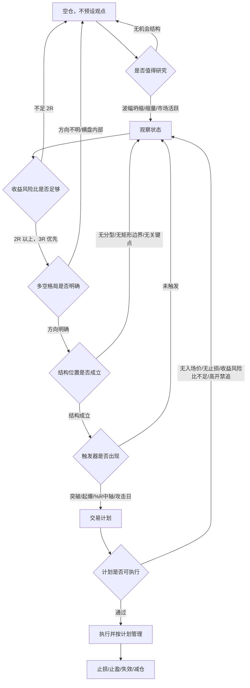

# C 信号 V2 设计契约

> 日期：2026-09-07  
> 状态：设计草案，待消融实验与实现拆解  
> 依据：已完整阅读 `/Users/vainve/obsidian/奇衡-dk/以短线交易秘诀为生/` 26 份原文笔记  
> 边界：本文只定义 C 信号 V2 语义与迁移规则，不修改 `strategy.py`、API 或前端。

## 一、核心判断

现有 `C观 / C回 / C突` 不应继续通过叠加新指标来增强。正确方向是把 C 信号从“综合条件命中”重构为“交易决策状态机”。

原文反复强调三条约束：

1. 指标必须可量化、可证伪、可回测，否则不是规则；
2. 技术指标只是 trigger，不负责预测未来；
3. 没有完成收益风险比、格局、结构与触发前，不应产生交易动作。

因此 C 信号 V2 的设计目标不是“更多指标共同投票”，而是让每个模块只回答一个问题：

```text
是否值得看？
是否值得做？
是否允许做？
结构位置在哪里？
此刻是否触发？
错了在哪里退出？
```

## 二、原文决策链



这条链路的关键不是顺序漂亮，而是权限分明：观察信号不能越权变成买点，触发信号不能越过交易计划，风险信号不能被解释成“再等等”。

## 三、信号分层

### 事实层

事实层只记录可计算观察，不做买卖判断。

| 事实 | 回答的问题 | 当前状态 |
| --- | --- | --- |
| Williams %R 50 中轴 | 价格重心在区间上半还是下半，是否穿越中轴 | 已实现事实层 |
| 多空力度 | 单根/短期 K 线里买方或卖方留下的距离 | 已实现事实层 |
| 威廉时钟 | 波幅是否坍缩，是否值得开始研究 | 已有第一版 |
| MA20/MA60/MA250 | 格局参照与趋势过滤 | 部分已有，MA250 待补 |
| 分型/双分型 | 结构低点/高点是否可定义 | 待实现 |
| 矩形边界 | 成本区、突破位、C 点止损 | 待强化 |
| 攻击日/阴包阳 | 极端情绪和触发结构 | 待实现 |
| 成交量 | 市场是否值得关注，不能单独决定买卖 | 部分已有 |
| 板块/概念共振 | 是否有外部环境支持 | 已有工作台共振，仍需校准 |

### 状态层

状态层把事实组合成“当前局面”，但仍不直接交易。

| 状态 | 定义 | 允许的下一步 |
| --- | --- | --- |
| `researchable` 值得研究 | 波幅坍缩、缩量、市场/板块活跃，或出现极端观察开关 | 进入观察 |
| `structure_candidate` 候选结构 | 分型、双分型、矩形、阴包阳等结构出现 | 等待许可和触发 |
| `pullback_setup` 回踩蓄势 | 大方向未坏，价格回到可执行区域 | 等待回踩触发 |
| `breakout_setup` 突破准备 | 价格靠近关键上沿或起爆点，结构可证伪 | 等待突破触发 |
| `repair_setup` 修复观察 | 下跌后出现修复迹象，但还未进入可执行状态 | 继续观察 |
| `risk_control` 风控状态 | 破位、过热、顶分型、计划失效或持仓回撤 | 退出/减仓/暂停 |

### 许可层

许可层使用排除法，不使用简单加分法。

| 许可结果 | 含义 |
| --- | --- |
| `forbidden` | 不允许交易，只能观察或风控 |
| `watch_only` | 可以关注，但不允许入场 |
| `pullback_allowed` | 只允许回踩参与，不允许追突破 |
| `breakout_allowed` | 允许突破参与，但必须过交易计划检查 |
| `risk_only` | 只处理风险，不寻找新入场 |

许可层应该吸收三重滤网思想：大周期只负责排除方向；交易周期只负责上膛；更小级别或明确价格突破才扣扳机。

## 四、C 信号 V2 命名

| 信号 | 中文名 | 类型 | 是否交易 | 必须字段 |
| --- | --- | --- | --- | --- |
| `C研` | 值得研究 | 观察 | 否 | 观察理由、触发事实、失效条件 |
| `C候` | 候选结构 | 候选 | 否 | 结构类型、关键高低点、失效条件 |
| `C修` | 修复观察 | 候选 | 否 | 修复依据、待确认条件、失效条件 |
| `C回` | 回踩参与 | 入场 | 是 | 入场价、止损价、目标价/2R、仓位 |
| `C突` | 突破触发 | 入场 | 是 | 突破价、止损价、追高风险、仓位 |
| `C爆` | 起爆/攻击日 | 入场 | 是 | 触发价、结构止损、收益风险比、仓位 |
| `C风` | 风险处理 | 风控 | 否 | 风险来源、处理动作、是否强制退出 |

关键修正：不是每类信号都需要止损价。只有“可执行入场”的信号必须有止损价。

```text
观察类：观察理由 + 失效条件
候选类：结构位置 + 待触发条件 + 失效条件
入场类：入场价 + 止损价 + 收益风险比 + 仓位
风控类：风险来源 + 处理动作
```

## 五、旧信号迁移规则

| 当前信号/字段 | V2 处理 |
| --- | --- |
| `C回 composite_pullback` | 保留为主力入场信号，但必须绑定结构止损与 2R/3R 检查 |
| `C突 composite_breakout` | 保留为突破触发，不再默认强买；先过高开/过热/距离 MA20 等执行审查 |
| `C观 composite_confirm` | 从参与候选中降级，迁移为 `C修` 或 `C候`，不直接进入入场池 |
| `C底 composite_bottom_divergence` | 保留为观察，不得升级为入场，除非后续结构和触发成立 |
| `C顶 composite_top_divergence` | 进入 `C风`，用于风险提示或持仓检查 |
| 旧 B / 新 B / 优化 B | 降级为 evidence，不再作为独立策略入口 |
| `setup_score / confirm_score / risk_score` | 保留为解释和排序辅助，但不再作为唯一决策骨架 |
| P2 多空力度 / Williams %R | 进入事实层和触发语境，不做全局加分 |

## 六、各信号的行为契约

### `C研` 值得研究

用途：降低交易频率，只提示“这里开始值得看”。

来源：

- 威廉时钟进入坍缩或倒计时；
- 缩量持续，参与者减少；
- 市场或板块出现明显活跃；
- 阴包阳创新低等观察开关出现。

禁止：

- 不得生成买入建议；
- 不得显示仓位；
- 不得因为“值得研究”进入参与候选主池。

### `C候` 候选结构

用途：说明某只股票已有可跟踪结构。

来源：

- 底分型/顶分型；
- 两个底分型形成低点抬高；
- 矩形边界可识别；
- 阴包阳创新低后出现右侧观察点。

要求：

- 必须说明结构高低点；
- 必须说明观察失效条件；
- 可以进入候选详情，但默认不进入“可参与”队列。

### `C修` 修复观察

用途：承接现有 `C观` 的合理部分。

定义：

- 下跌或弱势后出现修复痕迹；
- 可能有底背离、低点抬高、MACD 修复、%R 中轴改善；
- 但尚未满足入场触发和交易计划。

要求：

- 默认放在修复观察池；
- 不与 `C回 / C突 / C爆` 同权；
- 只有后续触发成立，才转换成入场类信号。

### `C回` 回踩参与

用途：趋势或结构许可后的回踩低吸。

必须满足：

- 许可层不是 `forbidden`；
- 趋势或结构没有破坏；
- 价格回到可定义支撑或结构区；
- 入场价、止损价、收益风险比可计算；
- 仓位不超过风险预算。

P2 解释规则：

- `%R 50-80` 或空头力占优不必直接警告，可能代表回踩空间；
- 但若跌破结构失效位，应立刻转 `C风`。

### `C突` 突破触发

用途：关键位突破后的右侧参与。

必须满足：

- 有明确突破位，例如近高、矩形上沿、昨日高点、起爆点；
- 不使用“有效突破”这类未来函数；
- 突破即触发，但必须有止损；
- 若次日高开、当日涨幅过大、距 MA20 过远或过热分过高，交易计划可给 `waiting/forbidden`。

P2 解释规则：

- `%R 下穿 50` 对 C突有确认价值；
- `%R < 20` 不应额外加分，应视为接近高位后的追价风险。

### `C爆` 起爆/攻击日

用途：把原文里最明确的 trigger 独立出来。

来源：

- 起爆点：`今日开盘 + (昨日最高 - 昨日收盘) * N`；
- 攻击日：阳线、吞没阴线、突破吞没阴线高点；
- 三重滤网第三层：拟买入状态下突破昨日高点上一档。

必须满足：

- 触发价明确；
- 结构止损明确；
- 收益风险比至少 2R，优先 3R；
- 如果风险空间过大，直接放弃，而不是缩小止损。

### `C风` 风险处理

用途：处理风险，不负责发现机会。

来源：

- 跌破结构低点、矩形 C 点、MA20 或计划止损；
- 顶分型、顶背离、过热回落；
- 持仓从峰值回撤触发减仓；
- 双向大幅波动，方向未分。

要求：

- 必须给出处理动作：退出、减仓、保护利润、暂停交易；
- 不应被新的观察信号覆盖；
- 风险信号优先级高于入场信号。

## 七、评分规则调整

V2 不取消评分，但改变评分职责。

当前评分容易被理解为“分高就能买”。V2 里评分只能服务排序和解释，不能越过许可层与交易计划。

建议拆分：

| 分数 | 职责 |
| --- | --- |
| `research_score` | 值不值得看 |
| `structure_score` | 结构是否清楚 |
| `permission_state` | 是否允许交易，非线性分数 |
| `trigger_quality` | 触发质量 |
| `execution_risk` | 执行风险 |
| `plan_quality` | 收益风险比、止损、仓位是否合格 |

其中 `permission_state` 不应是简单数值，而应是枚举状态。被 `forbidden` 拦截后，任何高分都不能进入可参与队列。

## 八、实现顺序

### Phase 1：契约与兼容层

1. 新增 V2 状态枚举和 payload 字段，不删除旧字段；
2. 当前 `C回 / C突 / C观` 继续输出，但新增 `v2_state / v2_signal / trade_intent`；
3. `C观` 在 UI 上逐步降级为修复观察；
4. 候选详情显示“观察/候选/可交易/风控”的类型差异。

### Phase 2：结构事实补齐

1. 实现威廉分型，排除包含关系；
2. 实现双底分型低点抬高；
3. 强化矩形边界和 C 点；
4. 实现阴包阳创新低和攻击日；
5. 实现起爆点字段，但参数先登记，不调参优化。

### Phase 3：交易计划接管

1. 入场类信号必须调用 `trade_plan.py`；
2. 无止损、无入场价、低于 2R，统一不能执行；
3. C突高开禁追进入计划层，而不是信号层；
4. C回/C突/C爆 各自输出不同计划模板。

### Phase 4：消融实验与版本升级

1. 分别对 C回、C突、C修、C爆 做样本回测；
2. 输出候选数、胜率、均值收益、最大亏损、重叠率；
3. 验证通过后再 bump `SCAN_STRATEGY_VERSION`；
4. 保留旧策略对比报告作为回滚依据。

## 九、验收标准

设计验收：

- 用户能一眼区分“只是值得看”和“可以交易”；
- 每个信号都能回答它自己的问题，不能越权；
- `C观` 不再被当成参与候选主入口；
- 放量不再作为买入依据；
- 风险信号不会被入场信号覆盖。

工程验收：

- 旧 API 字段兼容；
- 新字段有测试；
- 历史快照能标识策略版本；
- 回测默认使用次日开盘口径或清楚声明评估口径；
- 入场类信号缺失止损/入场/2R 时必须被交易计划拦截。

数据验收：

- 每个新增触发器必须有样本统计；
- 高胜率结果要优先检查未来函数和过拟合；
- 不能通过调参数让历史结果变漂亮；
- 参数必须登记来源、默认值、可调整范围和风险。

## 十、当前暂不做

- 不直接删除旧 C 信号；
- 不把 P2 指标接入全局分数；
- 不用 AI 主观总结替代结构化事实；
- 不恢复已归档主线功能；
- 不做“有效突破确认”这类事后定义；
- 不把观察池扩张成新的扫描控制台。

## 十一、下一步任务

`C_SIGNAL_V2_PHASE_1` 已完成。当前进入 `C_SIGNAL_V2_PHASE_2_1`：

1. 在旧 C 事件之外新增 V2 状态模型；
2. 输出 `事实 -> 状态 -> 许可 -> 动作` 的稳定 payload；
3. 单股和扫描候选都能读取同一份 V2 状态；
4. 前端 V2 视角优先展示状态模型，旧 C 事件保留为迁移来源；
5. 暂不替换 `strategy.py` 的触发阈值，不 bump `SCAN_STRATEGY_VERSION`。

这一步完成后，再进入威廉分型、矩形 C 点、攻击日和起爆点等结构触发器实现。

## 十二、Phase 1 落地状态

状态：已完成兼容层第一版。

本阶段只做语义分层，不改变旧策略触发条件：

> 因此在 Phase 1 中，图表指标、建仓/确认/风险评分、扫描排序基础仍会和旧 C 口径一致；V2 的差异只体现在信号命名、角色定位、交易意图、是否要求交易计划/止损价。若要让指标本身发生差异，需要进入 Phase 2 独立指标层。

- `stock_analyzer/c_signal_v2.py` 新增 V2 字段映射；
- 扫描结果并行输出 `v2_signal / v2_state / v2_role / trade_intent / requires_trade_plan / requires_stop_loss`；
- 图表 mark point 并行输出 camelCase V2 字段；
- 候选详情优先展示“观察 / 候选 / 可交易 / 风控”定位；
- `C观` 保留旧 `signal=C观`，但 V2 展示为 `C修 / 修复观察 / watch_only`；
- 旧/新/优化 B 点在 V2 中降为 `C候` 结构候选；
- 只有 `C回 / C突` 这类入场语义要求交易计划和止损价，观察类、候选类、风控类不强制止损价。

仍未做：

- 未新增威廉分型、矩形 C 点、攻击日或起爆点触发器；
- 未把 P2 方向指标接入策略阈值；
- 未 bump `SCAN_STRATEGY_VERSION`；
- 未删除任何旧 C 字段。

## 十三、Phase 2-1 落地状态

状态：已完成状态模型第一版。

本阶段开始建立 V2 独立判断骨架，但仍不替换旧策略触发器：

- `stock_analyzer/c_signal_v2.py` 新增 `build_c_signal_v2_state()`，输出 `facts / state / permission / signal / next_action`；
- 单股 `/api/analyze` 新增 `c_signal_v2_state`；
- 扫描候选新增 `v2_state_model`，候选解释和视图模型优先读取状态模型；
- 前端 `V2差异诊断` 优先展示状态模型，旧 C 视角继续显示旧字段；
- `C突 / C回` 只有在许可层允许时才显示为可执行计划；风险状态优先覆盖机会状态；
- `C风` 风控状态不要求新的入场止损价。

仍未做：

- 未新增威廉分型、矩形 C 点、攻击日、起爆点等新触发器；
- 未将旧 `setup/confirm/risk` 分数替换为 V2 分层评分；
- 未 bump `SCAN_STRATEGY_VERSION`。

## 十四、Phase 2-2 落地状态

状态：已完成 V2 系统排序第一版。

本阶段让 V2 状态模型开始影响候选工作台的默认排序，但仍不改变旧策略触发器：

- `build_c_signal_v2_priority()` 输出 `v2_priority_group / v2_priority_score / v2_queue_priority`；
- 工作台响应层在补完板块、概念、回放可信度后重算 V2 优先级；
- 默认系统排序优先使用 V2 优先级，再回退到旧 `final_score / rank_score`；
- 前端候选队列分组读取后端 V2 优先级，不再单独维护另一套系统排序语义；
- 旧 C 字段、手动排序、策略版本和扫描触发条件仍保持兼容。

排序原则：

- 机会池：`C突/C回` 可执行计划优先，`C修` 修复观察次之，研究/结构观察靠后，风控状态降级；
- 修复观察池：研究和修复优先，风险压制靠后；
- 风险池：`C风` 风险处理优先。

仍未做：

- 未新增威廉分型、矩形 C 点、攻击日、起爆点等新触发器；
- 未将旧 `setup/confirm/risk` 分数替换为 V2 分层评分；
- 未 bump `SCAN_STRATEGY_VERSION`。

## 十五、Phase 2-3 落地状态

状态：已完成 V2 事实层第一版。

本阶段补齐 V2 独立事实，但仍不替换旧策略触发器：

- `stock_analyzer/c_signal_v2_facts.py` 新增事实层构建器，统一输出 `trend / setup / risk / structure / trigger / v2_scores`；
- 威廉分型：实现 5 根 K 线确认分型，排除与前一根存在直接包含关系的中心 K 线，并保留 2 根 K 线确认滞后，避免把未确认的最新 K 线当成事实；
- 双底分型：记录最近底分型，并识别后一底分型低点抬高；
- 矩形边界：估算近 20 日上沿、下沿、中轴、宽度、突破价与 C 点/失效价；
- 攻击日/起爆点：识别突破昨日高点、阳包阴/放量/波幅扩张等攻击日事实，并登记 `今日开盘 + (昨日最高 - 昨日收盘) * N` 的起爆触发价；
- V2 分层事实分：输出 `research_score / structure_score / trigger_quality / execution_risk`，只用于解释和排序辅助，不直接给交易许可；
- 状态模型：`build_c_signal_v2_state()` 改为读取统一 facts；当没有旧入场事件但出现结构或触发事实时，只进入 `C候 / watch_only`，不越权生成入场计划；
- 解释层：新扫描候选解释和单股 V2 差异诊断展示事实摘要，便于和旧 C 评分口径对比。

边界：

- 旧 `strategy.py` 的 `composite_entry / composite_exit` 触发条件保持不变；
- 旧快照无法反推分型、矩形和攻击日事实，需要重扫后候选卡才会带完整 facts；
- `C爆` 仍未作为独立扫描事件接管候选池；
- 分型、矩形、攻击日起爆点目前是事实，不是买点；
- 未接入交易计划的 2R/3R 强制拦截；
- 未 bump `SCAN_STRATEGY_VERSION`。

下一步：

- 将事实层接入独立 V2 触发器，先产出 `C候` 与 `C爆` 的候选事件；
- 对 `C爆 / C突 / C回 / C修` 做样本消融，确认各事实对收益和风险的真实贡献；
- 通过回测后再决定是否替换旧 `composite_*` 触发器并升级策略版本。

## 十六、Phase 2-4 落地状态

状态：已完成单股图面 V2 独立事件第一版。

本阶段解决“V2 图面点位和旧 C 高度一致”的问题：

- `events.py` 新增 `build_v2_signal_events()`，从 `c_signal_v2_facts` 直接生成 V2 图面事件，不再依赖 `build_composite_signal_events()` 的旧 C 事件；
- `serializers.py` 新增 `mark_points_v2` 和 `event_stats.v2`，旧 `mark_points_composite` 保持不变；
- 前端图表：`V2` 视角读取 `mark_points_v2`，`旧C` 视角读取 `mark_points_composite`；
- V2 图面新增独立点位：
  - `C研`：底背离研究、阴包阳创新低等观察事实；
  - `C候`：双底抬高、矩形边界等结构候选；普通分型保留在 facts 中，暂不全部画到图面；
  - `C爆`：攻击日或起爆点触发；
  - `C风`：顶分型风控。

边界：

- `C爆` 目前是图面触发事实，虽然要求交易计划和止损，但尚未接管候选池入场权限；
- 旧扫描快照、候选池排序和 `SCAN_STRATEGY_VERSION` 暂不改变；
- V2 图面事件会比旧 C 更多，因为观察/结构事实被显式展示，后续需通过消融回测裁剪噪音；
- 多周期图表会随序列化结果带上 V2 事件，但尚未为不同周期单独调参。

下一步：

- 将 `C候 / C爆` 接入扫描候选池，但先分池：`C候` 进入修复/结构观察，`C爆` 进入机会池并强制交易计划校验；
- 对 V2 图面点进行样本统计，裁剪低贡献事实；
- 把 V2 事件与交易计划联动，计划 blocked 的 `C爆` 不允许显示为可执行。
