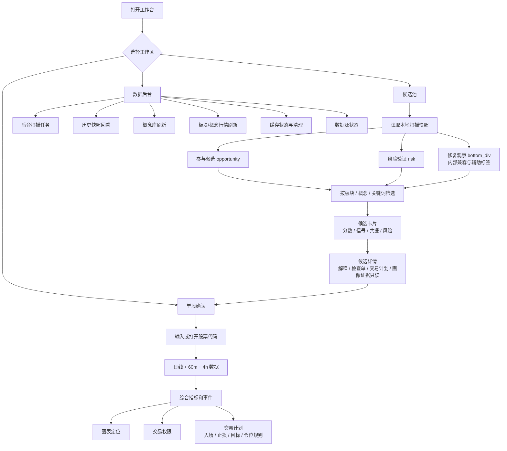
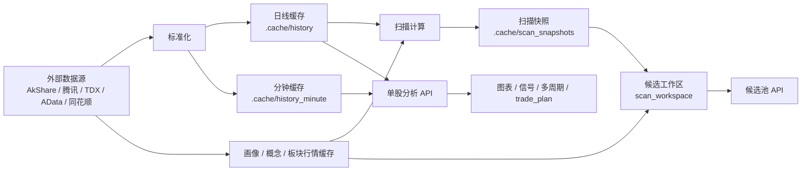

# Current Feature Flow

本文件记录当前已保留的产品逻辑。历史主线设计已经归档，当前默认工作台是“候选池 -> 单股确认 -> 数据后台”。

## User Flow

## Backend Flow

## Core Surfaces

| Surface | Role | Keep | Keep Out |
| --- | --- | --- | --- |
| 候选池 | 消费本地结果，快速定位值得确认或需要规避的股票 | 参与候选、风险验证、搜索筛选、候选卡片、候选详情 | 扫描治理、历史回放、策略实验、主线拆解 |
| 单股确认 | 把一只股票转成可执行判断 | 图表、综合事件、交易权限、交易计划、多周期、画像核对 | 旧/新/优化信号作为一级模式、全市场扫描入口 |
| 数据后台 | 处理数据和任务状态 | 扫描任务、刷新策略、历史快照、概念库、板块行情、缓存清理、数据源状态 | 个股交易判断、候选详情 |

## Retired Or Demoted

- 主线、主线拆解、市场决策、`mainline_id`：已移出当前产品契约。
- `/api/scan_batch`：同步批扫入口退役，使用 `/api/scan_jobs`。
- `bottom_div`：修复观察池，2026-09-20 起为第三个一级候选池入口（参与候选 / 风险验证 / 修复观察）。
- 概念图谱 CRUD：保留内部实验能力，不进入核心数据健康判断。
- 画像证据编辑器：候选详情只读展示画像质量。
- 回放校准、历史快照、刷新策略：只在数据后台处理。

## Guardrails

- 候选池不能重新扩展成扫描控制台。
- 单股确认只使用综合研判作为主视图。
- 数据后台可以复杂，但不能把治理动作推回候选池。
- 已归档的主线设计不能被当成当前 API 或 UI 契约。
