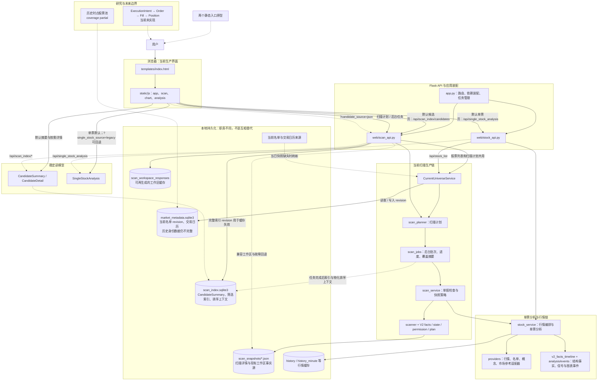

# Project Structure And Roadmap

## Product In One Sentence

这是一个**研究驱动、人工判断优先的 A 股短线工作台**：系统整理行情、结构事实、候选和条件计划；用户保留最终决策和交易动作。当前没有真实账户、订单、成交或自动下单职责。

## Runtime Map



图例：实线表示默认生产路径；虚线表示兼容回退、索引后处理，或研究/未来能力。

## Current Status

| Area | Status | What that means |
| --- | --- | --- |
| 当前股票名单 | **生产使用** | 扫描计划和股票列表使用同一 SQLite 名单 revision；9/24 revision 审计覆盖 5,569 个成员，其中 5,551 个当日收盘 bar、18 个旧数据样本；provider attempts 已核对。无新 K 线不等于停牌 |
| 行情与分析 | **生产使用，部分旧数据身份未知** | provider、缓存、归一化、结构分析和图表已连通；新数据携带来源与 bar 状态，旧缓存仍可能缺少来源证据 |
| 扫描快照 | **生产事实源** | 每票扫描详情仍保存为 JSON；这些文件尚未被 SQLite 取代 |
| SQLite 扫描索引 | **候选页默认生产查询源** | schema v8 对账源目录 revision；扫描后增量索引并物化排序上下文；列表默认读 SQLite，详情仍由 manifest 精确投影 JSON 快照 |
| 候选与单票读模型 | **两类稳定模型均已默认** | 候选页默认用 `CandidateSummary/Detail`，`?candidate_source=json` 回退；单票页默认用 `SingleStockAnalysis`，`?single_stock_source=legacy` 回退；页面已由用户确认正常 |
| 排序 | **新政策已实现并物化** | 排序只使用个股信号/结构、确认、风险及该股宏观许可；行业/概念保留筛选与候选分布浏览，不参与排序/许可。最新日两种 scope 已重算；旧策略上下文会拒绝应用并回退个股快照排序。见 accepted ADR-0002 |
| 历史证券身份 | **研究底座，partial** | 当前扫描不依赖完整北交所历史成员；不能据此声称历史研究无幸存者偏差 |
| UI 方向 | **候选优先已选，视觉重设计暂缓** | 用户未发现明显难找/难懂的信息，但认为整体 UI 可优化；代码输入/回车可进入单票图表。尚无并排比较和正式多任务观察；前端技术栈未决定 |
| 自动化交易 | **未实现** | 没有账户持仓、订单、成交或券商下单链路 |

### SQLite 与 JSON 的边界

项目已经使用 SQLite，但它们承担的职责不同：

- `.cache/market_metadata.sqlite3`：当前名单、交易日历和参考数据版本。
- `.cache/scan_index.sqlite3`：由 JSON 扫描快照派生的摘要索引和候选排序上下文。
- `.cache/scan_snapshots/`：当前仍保存候选详情和扫描事实，是 SQLite 详情投影的来源。
- `.cache/history/`、`.cache/history_minute/`：行情数据缓存。
- `.cache/scan_workspace_responses/`：可丢弃、可重建的工作区响应缓存。

本机 2026-09-26 的目录量级约为：扫描快照 JSON 3.6 GB、扫描索引 SQLite 160 MB、
市场元数据 SQLite 12 MB、工作区响应缓存 431 MB、日线历史缓存 209 MB。这是单机
`du` 观测值，会随运行和缓存淘汰变化，不是部署容量承诺。

## Important Code Areas

```text
app.py                         Flask 路由与应用装配；后续应继续缩小为 composition root
stock_analyzer/web/            HTTP 请求解析、响应和错误边界
stock_analyzer/providers/      行情、名单和参考数据的上游适配器
stock_analyzer/current_universe.py 当前股票池的交易日解析、刷新和 revision 固定
stock_analyzer/stock_service.py 行情与单票分析编排
stock_analyzer/scan_service.py 单股扫描、快照复用与数据质量摘要
stock_analyzer/scanner.py      候选信号计算入口
stock_analyzer/c_signal_v2_facts.py / c_signal_v2.py 结构事实与状态/许可
stock_analyzer/v2_facts_timeline.py / events.py 单票历史事件时间线
stock_analyzer/scan_snapshot.py / scan_jobs.py 扫描快照和后台任务
stock_analyzer/scan_index_store.py SQLite 候选摘要索引
stock_analyzer/*_read_model.py 稳定 API 读模型投影
static/js/ + templates/        当前原生 JS 页面、工作台和图表
scripts/                       数据导入、扫描索引重建、审计和对比工具
tests/                         离线单元、API、数据契约和回归测试
docs/current|adr|research|archive 当前契约、架构决策、研究证据和历史资料
prototypes/ui-direction/       候选优先与单票优先静态交互原型
```

## Next Work In Order

1. **继续积累同政策的跨日样本**：首版 next-open 基线已建立，但只有 4 个一日样本日期、2 个三日样本日期，5/10 日为空，且未显示可信单调性。保持政策不变，持续记录当日 revision 与后续结果。
2. **观测两条稳定模型默认路径**：候选异常可用 `?candidate_source=json`，单票异常可用 `?single_stock_source=legacy` 回退；按真实使用反馈补失败边界测试。
3. **渐进整理旧文档与兼容代码**：逐份核实引用后再归档，不用批量删除破坏研究证据或回退能力。
4. **待用户重启 UI 设计时再评估技术栈**：当前 Flask 模块化单体和原生 JS 能支撑研究工作台；视觉与任务结构明确前，不先迁移 React/Vue。

当前状态：9/24 真实收盘扫描已核验名单 revision、provider attempts 和数据覆盖；103,437 份快照已全量对账，候选摘要/详情 SQLite 已切为默认。单票稳定读模型也已默认；两条旧接口保留回退。历史证券身份 coverage 仍为 partial；旧缓存来源可能 unknown；自动化交易未实现且不在当前阶段范围。

## Architecture Assessment

当前采用 Flask + 模块化 Python 单体 + 原生 JS，和个人研究工作台的运行规模相称。此阶段没有证据支持先拆微服务或先迁移 React/Vue。JSON 快照负责完整扫描事实，SQLite 负责默认在线查询与版本化排序，边界已经明确；接下来主要风险从“读链迁移”转为“跨日研究证据是否足够”。

未来交易自动化应从独立的 `ExecutionIntent`、风控、订单和成交领域边界演进，不把当前 `TradePlan` 直接改称真实执行或持仓。
