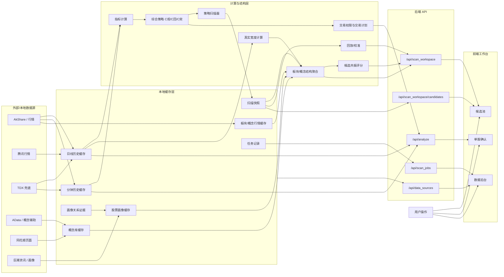
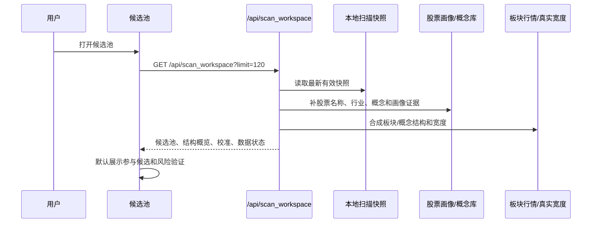

# Data Flow

当前项目的数据流遵循一个核心原则：**本地数据先落盘，候选池消费快照，单股确认负责最终执行判断**。

## Core Flow



## Workspace Flow



## Candidate Filtering

`/api/scan_workspace/candidates` 只负责从本地完整快照里做轻量筛选：

- `scan_type`
- `sector`
- `concept`
- `query`
- `limit`
- `offset`

不再支持 `mainline_id`。如果后续重新设计更高层主题能力，应先形成新的领域契约和测试，再接回候选筛选。

## Single Stock Flow


## Data Backstage Flow

```mermaid
flowchart TD
    A[数据后台] --> B[扫描任务]
    A --> C[历史快照]
    A --> D[概念库]
    A --> E[板块/概念行情]
    A --> F[数据源状态]
    A --> G[缓存清理]

    B --> B1[/api/scan_jobs]
    C --> C1[/api/scan_history]
    D --> D1[/api/stock_concepts/status + refresh]
    E --> E1[/api/board_market + refresh]
    F --> F1[/api/data_sources]
    G --> G1[/api/scan_cache/prune]
```

## Boundary Rules

- 候选池只消费本地结果，不承载刷新策略、缓存清理或任务细节。
- 单股确认负责执行判断，不负责全市场扫描。
- 数据后台负责刷新、重扫、历史回看、校准和治理。
- 概念图谱和画像证据可以辅助结构解释，但当前不是核心产品入口。
- AI 不应替代数据源、评分、回放、交易计划或风险判断。
